# Introduction

This is an Exploratory Data Analysis of a dataset (https://www.kaggle.com/thec03u5/fifa-18-demo-player-dataset) containing player characteristics and statistics in the Fifa 18 video game.

# Imports


```python
import pandas as pd
import numpy as np

import matplotlib.pyplot as plt
import seaborn as sns
import plotly.plotly as py

from sklearn.model_selection import train_test_split
from sklearn.metrics import mean_absolute_error, mean_squared_error
import xgboost as xgb

from itertools import product
import itertools
from collections import OrderedDict
import operator
import re
from math import sqrt
import pickle
```

# Data Preprocessing


```python
original_df = pd.read_csv('CompleteDataset.csv', error_bad_lines=False, low_memory=False)
```

## Metadata


```python
processed_df = original_df.copy()
processed_df.head()
```


<div>
<style scoped>
    .dataframe tbody tr th:only-of-type {
        vertical-align: middle;
    }

    .dataframe tbody tr th {
        vertical-align: top;
    }

    .dataframe thead th {
        text-align: right;
    }
</style>
<table border="1" class="dataframe">
  <thead>
    <tr style="text-align: right;">
      <th></th>
      <th>Unnamed: 0</th>
      <th>Name</th>
      <th>Age</th>
      <th>Photo</th>
      <th>Nationality</th>
      <th>Flag</th>
      <th>Overall</th>
      <th>Potential</th>
      <th>Club</th>
      <th>Club Logo</th>
      <th>...</th>
      <th>RB</th>
      <th>RCB</th>
      <th>RCM</th>
      <th>RDM</th>
      <th>RF</th>
      <th>RM</th>
      <th>RS</th>
      <th>RW</th>
      <th>RWB</th>
      <th>ST</th>
    </tr>
  </thead>
  <tbody>
    <tr>
      <th>0</th>
      <td>0</td>
      <td>Cristiano Ronaldo</td>
      <td>32</td>
      <td>https://cdn.sofifa.org/48/18/players/20801.png</td>
      <td>Portugal</td>
      <td>https://cdn.sofifa.org/flags/38.png</td>
      <td>94</td>
      <td>94</td>
      <td>Real Madrid CF</td>
      <td>https://cdn.sofifa.org/24/18/teams/243.png</td>
      <td>...</td>
      <td>61.0</td>
      <td>53.0</td>
      <td>82.0</td>
      <td>62.0</td>
      <td>91.0</td>
      <td>89.0</td>
      <td>92.0</td>
      <td>91.0</td>
      <td>66.0</td>
      <td>92.0</td>
    </tr>
    <tr>
      <th>1</th>
      <td>1</td>
      <td>L. Messi</td>
      <td>30</td>
      <td>https://cdn.sofifa.org/48/18/players/158023.png</td>
      <td>Argentina</td>
      <td>https://cdn.sofifa.org/flags/52.png</td>
      <td>93</td>
      <td>93</td>
      <td>FC Barcelona</td>
      <td>https://cdn.sofifa.org/24/18/teams/241.png</td>
      <td>...</td>
      <td>57.0</td>
      <td>45.0</td>
      <td>84.0</td>
      <td>59.0</td>
      <td>92.0</td>
      <td>90.0</td>
      <td>88.0</td>
      <td>91.0</td>
      <td>62.0</td>
      <td>88.0</td>
    </tr>
    <tr>
      <th>2</th>
      <td>2</td>
      <td>Neymar</td>
      <td>25</td>
      <td>https://cdn.sofifa.org/48/18/players/190871.png</td>
      <td>Brazil</td>
      <td>https://cdn.sofifa.org/flags/54.png</td>
      <td>92</td>
      <td>94</td>
      <td>Paris Saint-Germain</td>
      <td>https://cdn.sofifa.org/24/18/teams/73.png</td>
      <td>...</td>
      <td>59.0</td>
      <td>46.0</td>
      <td>79.0</td>
      <td>59.0</td>
      <td>88.0</td>
      <td>87.0</td>
      <td>84.0</td>
      <td>89.0</td>
      <td>64.0</td>
      <td>84.0</td>
    </tr>
    <tr>
      <th>3</th>
      <td>3</td>
      <td>L. Suárez</td>
      <td>30</td>
      <td>https://cdn.sofifa.org/48/18/players/176580.png</td>
      <td>Uruguay</td>
      <td>https://cdn.sofifa.org/flags/60.png</td>
      <td>92</td>
      <td>92</td>
      <td>FC Barcelona</td>
      <td>https://cdn.sofifa.org/24/18/teams/241.png</td>
      <td>...</td>
      <td>64.0</td>
      <td>58.0</td>
      <td>80.0</td>
      <td>65.0</td>
      <td>88.0</td>
      <td>85.0</td>
      <td>88.0</td>
      <td>87.0</td>
      <td>68.0</td>
      <td>88.0</td>
    </tr>
    <tr>
      <th>4</th>
      <td>4</td>
      <td>M. Neuer</td>
      <td>31</td>
      <td>https://cdn.sofifa.org/48/18/players/167495.png</td>
      <td>Germany</td>
      <td>https://cdn.sofifa.org/flags/21.png</td>
      <td>92</td>
      <td>92</td>
      <td>FC Bayern Munich</td>
      <td>https://cdn.sofifa.org/24/18/teams/21.png</td>
      <td>...</td>
      <td>NaN</td>
      <td>NaN</td>
      <td>NaN</td>
      <td>NaN</td>
      <td>NaN</td>
      <td>NaN</td>
      <td>NaN</td>
      <td>NaN</td>
      <td>NaN</td>
      <td>NaN</td>
    </tr>
  </tbody>
</table>
<p>5 rows × 75 columns</p>
</div>


```python
processed_df.info()
```

    <class 'pandas.core.frame.DataFrame'>
    RangeIndex: 17981 entries, 0 to 17980
    Data columns (total 75 columns):
    Unnamed: 0             17981 non-null int64
    Name                   17981 non-null object
    Age                    17981 non-null int64
    Photo                  17981 non-null object
    Nationality            17981 non-null object
    Flag                   17981 non-null object
    Overall                17981 non-null int64
    Potential              17981 non-null int64
    Club                   17733 non-null object
    Club Logo              17981 non-null object
    Value                  17981 non-null object
    Wage                   17981 non-null object
    Special                17981 non-null int64
    Acceleration           17981 non-null object
    Aggression             17981 non-null object
    Agility                17981 non-null object
    Balance                17981 non-null object
    Ball control           17981 non-null object
    Composure              17981 non-null object
    Crossing               17981 non-null object
    Curve                  17981 non-null object
    Dribbling              17981 non-null object
    Finishing              17981 non-null object
    Free kick accuracy     17981 non-null object
    GK diving              17981 non-null object
    GK handling            17981 non-null object
    GK kicking             17981 non-null object
    GK positioning         17981 non-null object
    GK reflexes            17981 non-null object
    Heading accuracy       17981 non-null object
    Interceptions          17981 non-null object
    Jumping                17981 non-null object
    Long passing           17981 non-null object
    Long shots             17981 non-null object
    Marking                17981 non-null object
    Penalties              17981 non-null object
    Positioning            17981 non-null object
    Reactions              17981 non-null object
    Short passing          17981 non-null object
    Shot power             17981 non-null object
    Sliding tackle         17981 non-null object
    Sprint speed           17981 non-null object
    Stamina                17981 non-null object
    Standing tackle        17981 non-null object
    Strength               17981 non-null object
    Vision                 17981 non-null object
    Volleys                17981 non-null object
    CAM                    15952 non-null float64
    CB                     15952 non-null float64
    CDM                    15952 non-null float64
    CF                     15952 non-null float64
    CM                     15952 non-null float64
    ID                     17981 non-null int64
    LAM                    15952 non-null float64
    LB                     15952 non-null float64
    LCB                    15952 non-null float64
    LCM                    15952 non-null float64
    LDM                    15952 non-null float64
    LF                     15952 non-null float64
    LM                     15952 non-null float64
    LS                     15952 non-null float64
    LW                     15952 non-null float64
    LWB                    15952 non-null float64
    Preferred Positions    17981 non-null object
    RAM                    15952 non-null float64
    RB                     15952 non-null float64
    RCB                    15952 non-null float64
    RCM                    15952 non-null float64
    RDM                    15952 non-null float64
    RF                     15952 non-null float64
    RM                     15952 non-null float64
    RS                     15952 non-null float64
    RW                     15952 non-null float64
    RWB                    15952 non-null float64
    ST                     15952 non-null float64
    dtypes: float64(26), int64(6), object(43)
    memory usage: 10.3+ MB


# Data Preprocessing

Here we will take part in data cleaning: finding missing values, converting to desired data types, removing unwanted data etc.


```python
# Drop the colums that cannot be used
processed_df = processed_df.drop(['Photo', 'Flag', 'Club Logo', 'Special', 'ID'], 1)
```


```python
# Convert the numerical values from string type to integer type. 
def str_to_int(string):
    try:
        integer = float(string)
        return integer
    except ValueError:
        return np.nan
    
processed_df['Acceleration'] = processed_df['Acceleration'].apply(str_to_int)
processed_df['Aggression'] = processed_df['Aggression'].apply(str_to_int)
processed_df['Agility'] = processed_df['Agility'].apply(str_to_int)
processed_df['Balance'] = processed_df['Balance'].apply(str_to_int)
processed_df['Ball control'] = processed_df['Ball control'].apply(str_to_int)
processed_df['Composure'] = processed_df['Composure'].apply(str_to_int)
processed_df['Crossing'] = processed_df['Crossing'].apply(str_to_int)
processed_df['Curve'] = processed_df['Curve'].apply(str_to_int)
processed_df['Dribbling'] = processed_df['Dribbling'].apply(str_to_int)
processed_df['Finishing'] = processed_df['Finishing'].apply(str_to_int)
processed_df['Free kick accuracy'] = processed_df['Free kick accuracy'].apply(str_to_int)
processed_df['GK diving'] = processed_df['GK diving'].apply(str_to_int)
processed_df['GK handling'] = processed_df['GK handling'].apply(str_to_int)
processed_df['GK kicking'] = processed_df['GK kicking'].apply(str_to_int)
processed_df['GK positioning'] = processed_df['GK positioning'].apply(str_to_int)
processed_df['GK reflexes'] = processed_df['GK reflexes'].apply(str_to_int)
processed_df['Heading accuracy'] = processed_df['Heading accuracy'].apply(str_to_int)
processed_df['Interceptions'] = processed_df['Interceptions'].apply(str_to_int)
processed_df['Jumping'] = processed_df['Jumping'].apply(str_to_int)
processed_df['Long passing'] = processed_df['Long passing'].apply(str_to_int)
processed_df['Long shots'] = processed_df['Long shots'].apply(str_to_int)
processed_df['Marking'] = processed_df['Marking'].apply(str_to_int)
processed_df['Penalties'] = processed_df['Penalties'].apply(str_to_int)
processed_df['Positioning'] = processed_df['Positioning'].apply(str_to_int)
processed_df['Reactions'] = processed_df['Reactions'].apply(str_to_int)
processed_df['Short passing'] = processed_df['Short passing'].apply(str_to_int)
processed_df['Shot power'] = processed_df['Shot power'].apply(str_to_int)
processed_df['Sliding tackle'] = processed_df['Sliding tackle'].apply(str_to_int)
processed_df['Sprint speed'] = processed_df['Sprint speed'].apply(str_to_int)
processed_df['Stamina'] = processed_df['Stamina'].apply(str_to_int)
processed_df['Standing tackle'] = processed_df['Standing tackle'].apply(str_to_int)
processed_df['Strength'] = processed_df['Strength'].apply(str_to_int)
processed_df['Vision'] = processed_df['Vision'].apply(str_to_int)
processed_df['Volleys'] = processed_df['Volleys'].apply(str_to_int)
processed_df['CAM'] = processed_df['CAM'].apply(str_to_int)
processed_df['CB'] = processed_df['CB'].apply(str_to_int)
processed_df['CDM'] = processed_df['CDM'].apply(str_to_int)
processed_df['CF'] = processed_df['CF'].apply(str_to_int)
processed_df['CM'] = processed_df['CM'].apply(str_to_int)
processed_df['LAM'] = processed_df['LAM'].apply(str_to_int)
processed_df['LB'] = processed_df['LB'].apply(str_to_int)
processed_df['LCM'] = processed_df['LCM'].apply(str_to_int)
processed_df['LDM'] = processed_df['LDM'].apply(str_to_int)
processed_df['LF'] = processed_df['LF'].apply(str_to_int)
processed_df['LM'] = processed_df['LM'].apply(str_to_int)
processed_df['LS'] = processed_df['LS'].apply(str_to_int)
processed_df['LW'] = processed_df['LW'].apply(str_to_int)
processed_df['LWB'] = processed_df['LWB'].apply(str_to_int)
processed_df['RAM'] = processed_df['RAM'].apply(str_to_int)
processed_df['RB'] = processed_df['RB'].apply(str_to_int)
processed_df['RCB'] = processed_df['RCB'].apply(str_to_int)
processed_df['RCM'] = processed_df['RCM'].apply(str_to_int)
processed_df['RDM'] = processed_df['RDM'].apply(str_to_int)
processed_df['RF'] = processed_df['RF'].apply(str_to_int)
processed_df['RM'] = processed_df['RM'].apply(str_to_int)
processed_df['RS'] = processed_df['RS'].apply(str_to_int)
processed_df['RW'] = processed_df['RW'].apply(str_to_int)
processed_df['RWB'] = processed_df['RWB'].apply(str_to_int)
processed_df['ST'] = processed_df['ST'].apply(str_to_int)
```


```python
#Convert wages and values to floats
def str_to_float(string):
    if string[-1] == 'M':
        value = float(string[1:-1])*1000000
    elif string[-1] == 'K':
        value = float(string[1:-1])*1000
    else:
        value = float(string[1:])
    return value
        
processed_df['Value'] = processed_df['Value'].apply(str_to_float)
processed_df['Wage'] = processed_df['Wage'].apply(str_to_float)
```

# Exploratory Data Analysis

### Player Origins
Out of curiosity let's look at where most of the players come from.


```python
#Number of player per country
nations = {'Nation': 0}
def count_nations(nation):
    #Count the players per country
    if (nation in nations):
        nations[nation] = nations[nation] + 1
    else:
        nations[nation] = 1

processed_df['Nationality'].apply(count_nations)
nations.pop('Nation', None)
#Sort and take the top 10%
sorted_nations = OrderedDict(sorted(nations.items(), key=lambda x: x[1], reverse=True))
sorted_nations = dict((k, sorted_nations[k]) for k in list(sorted_nations.keys())[0:int(len(sorted_nations)/10)])

fig = plt.figure(figsize=(16,4))
ax = fig.add_subplot(111)
ax.bar(range(len(sorted_nations)), list(sorted_nations.values()))
plt.xticks(range(len(sorted_nations)), list(sorted_nations.keys()), rotation=45,  ha='left')
plt.xlabel('Nations')
plt.ylabel('Number of players')
plt.show()

```


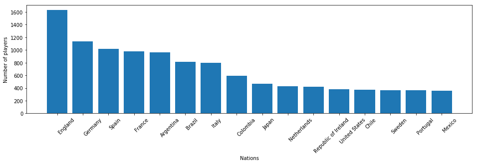


```python
#Number of player per continent
continent_list = {
    'Africa' : ['Algeria','Angola','Benin','Botswana','Burkina','Burundi','Cameroon','Cape Verde','Central African Republic','Chad','Comoros','Congo','DR Congo','Djibouti','Egypt','Equatorial Guinea','Eritrea','Ethiopia','Gabon','Gambia','Ghana','Guinea','Guinea Bissau','Ivory Coast','Kenya','Lesotho','Liberia','Libya','Madagascar','Malawi','Mali','Mauritania','Mauritius','Morocco','Mozambique','Namibia','Niger','Nigeria','Rwanda','Sao Tome and Principe','Senegal','Seychelles','Sierra Leone','Somalia','South Africa','South Sudan','Sudan','Swaziland','Tanzania','Togo','Tunisia','Uganda','Zambia','Zimbabwe','Burkina Faso'],
    'Antarctica' : ['Fiji','Kiribati','Marshall Islands','Micronesia','Nauru','New Zealand','Palau','Papua New Guinea','Samoa','Solomon Islands','Tonga','Tuvalu','Vanuatu'],
    'Asia' : ['Afghanistan','Bahrain','Bangladesh','Bhutan','Brunei','Burma (Myanmar)','Cambodia','China','China PR','East Timor','India','Indonesia','Iran','Iraq','Israel','Japan','Jordan','Kazakhstan','North Korea','South Korea','Korea Republic','Korea DPR','Kuwait','Kyrgyzstan','Laos','Lebanon','Malaysia','Maldives','Mongolia','Nepal','Oman','Pakistan','Palestine','Philippines','Qatar','Russian Federation','Saudi Arabia','Singapore','Sri Lanka','Syria','Tajikistan','Thailand','Turkey','Turkmenistan','United Arab Emirates','Uzbekistan','Vietnam','Yemen','Russia'],
    'Australia Oceania' : ['Australia','New Caledonia'],
    'Europe' : ['Albania','Andorra','Armenia','Austria','Azerbaijan','Belarus','Belgium','Bosnia Herzegovina','Bulgaria','Croatia','Cyprus','Czech Republic','Denmark','Estonia','Finland','France','FYR Macedonia','Georgia','Germany','Greece','Hungary','Iceland','Ireland','Italy','Kosovo','Latvia','Liechtenstein','Lithuania','Luxembourg','Macedonia','Malta','Moldova','Monaco','Montenegro','Netherlands','Northern Ireland','Norway','Poland','Portugal','Romania','San Marino','Scotland','Serbia','Slovakia','Slovenia','Spain','Sweden','Switzerland','Ukraine','England','Vatican City','Republic of Ireland','Wales'],
    'North America' : ['Antigua and Barbuda','Bahamas','Barbados','Belize','Canada','Costa Rica','Cuba','Dominica','Dominican Republic','El Salvador','Grenada','Guatemala','Haiti','Honduras','Jamaica','Mexico','Nicaragua','Panama','Saint Kitts and Nevis','Saint Lucia','Saint Vincent and the Grenadines','Trinidad and Tobago','United States'],
    'South America' : ['Argentina','Bolivia','Brazil','Chile','Colombia','Curacao','Ecuador','Guyana','Paraguay','Peru','Suriname','Trinidad & Tobago','Uruguay','Venezuela']
}
continents = {'Africa' : 0, 'Antarctica' : 0,'Asia' : 0, 'Australia Oceania' : 0, 'Europe' : 0, 'North America' : 0, 'South America' : 0}

def count_continent(nation):
    #Count the players per continent
    for continent in continent_list:
        if nation in continent_list[continent]:
            continents[continent] = continents[continent] + 1
            return continent
    return np.NaN

processed_df['Nationality'].apply(count_continent)
sorted_continents = OrderedDict(sorted(continents.items(), key=lambda x: x[1], reverse=True))

fig = plt.figure(figsize=(10,4))
ax = fig.add_subplot(111)
ax.bar(range(len(sorted_continents)), list(sorted_continents.values()))
plt.xticks(range(len(sorted_continents)), list(sorted_continents.keys()), rotation = 45)
plt.xlabel('Continent')
plt.ylabel('Number of players')
plt.show()
```


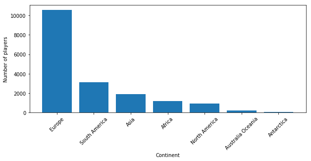


In the five biggest professional football leagues let's look at the proportion of foreign player.


```python
club_list_per_league = {
    'England' : ['Manchester United', 'Chelsea', 'Manchester City', 'Arsenal', 'Tottenham Hotspur', 'Liverpool', 'Leicester City', 'Southampton', 'Everton', 'Swansea City', 'Stoke City', 'West Ham United', 'Watford', 'Bournemouth', 'Crystal Palace', 'West Bromwich Albion', 'Burnley', 'Newcastle United', 'Brighton & Hove Albion', 'Huddersfield Town'],
    'France' : ['Paris Saint-Germain', 'AS Monaco', 'AS Saint-Étienne', 'Olympique de Marseille', 'Olympique Lyonnais', 'OGC Nice', 'Girondins de Bordeaux', 'Stade Rennais FC', 'Montpellier Hérault SC', 'FC Nantes', 'En Avant de Guingamp', 'Amiens SC Football', 'Dijon FCO', 'Angers SCO', 'LOSC Lille', 'RC Strasbourg', 'SM Caen', 'Toulouse FC', 'ES Troyes AC', 'FC Metz'],
    'Germany' : ['FC Bayern Munich', 'Borussia Dortmund', 'Bayer 04 Leverkusen', 'FC Schalke 04', 'RB Leipzig', 'Borussia Mönchengladbach', 'TSG 1899 Hoffenheim', 'SV Werder Bremen', 'VfL Wolfsburg', 'Hertha BSC Berlin', 'Eintracht Frankfurt', 'VfB Stuttgart', 'Eintracht Braunschweig', 'FC Augsburg', '1. FSV Mainz 05', 'Hamburger SV', 'Hannover 96', 'SC Freiburg'],
    'Italy' : ['Juventus', 'Milan', 'Napoli', 'Inter', 'Roma', 'Torino', 'Lazio', 'Genoa', 'Sassuolo', 'Sampdoria', 'Fiorentina', 'Atalanta', 'Sampdoria', 'Bologna', 'Chievo Verona', 'Udinese', 'Cagliari', 'Ferrara (SPAL)', 'Crotone', 'Hellas Verona', 'Benevento Calcio'],
    'Spain' : ['Real Madrid CF', 'FC Barcelona', 'Atletico Madrid', 'Athletic Club de Bilbao','1. FC Köln', 'Villarreal CF', 'Real Sociedad', 'UD Las Palmas', 'RC Celta de Vigo', 'RCD Espanyol', 'SD Eibar', 'Valencia CF', 'Sevilla FC', 'RC Deportivo de La Coruña', 'Real Betis Balompié', 'Getafe CF', 'Girona CF', 'Deportivo Alav√©s', 'Levante UD', 'Deportivo Alavés', 'Málaga CF'],
}

two_columns = processed_df[['Nationality', 'Club']]

nationality_proportion = {'England' : [0, 0], 'France' : [0, 0], 'Germany' : [0, 0], 'Italy' : [0, 0], 'Spain' : [0, 0]}
def count_foreign_players():
    index = 0
    while (index < len(two_columns)):
        for country in club_list_per_league:
            if two_columns['Club'][index] in club_list_per_league[country]:
                if two_columns['Nationality'][index] == country:
                    nationality_proportion[country][0] = nationality_proportion[country][0] + 1
                else:
                    nationality_proportion[country][1] = nationality_proportion[country][1] + 1
        index += 1

count_foreign_players()
N = 5
home = (nationality_proportion['England'][0], nationality_proportion['France'][0], nationality_proportion['Germany'][0], nationality_proportion['Italy'][0], nationality_proportion['Spain'][0])
foreign = (nationality_proportion['England'][1], nationality_proportion['France'][1], nationality_proportion['Germany'][1], nationality_proportion['Italy'][1], nationality_proportion['Spain'][1])
ind = np.arange(N)    # the x locations for the groups
width = 0.35       # the width of the bars: can also be len(x) sequence

fig = plt.figure(figsize=(6,4))
ax = fig.add_subplot(111)
p1 = ax.bar(ind, home, width)
p2 = ax.bar(ind, foreign, width, bottom = home)
plt.ylabel('Number of Players')
plt.title('Proportion of foreign player per league')
plt.xticks(ind, ('England', 'France', 'Germany', 'Italy', 'Spain'))
plt.yticks(np.arange(0, 700, 100))
plt.legend((p1[0], p2[0]), ('Home', 'Foreign'))
plt.show()
```


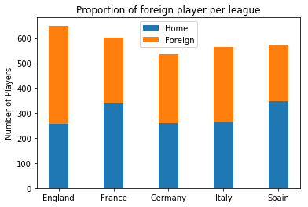


Interestingly even though Europe has the most players, their notorious leagues have many international players.

### Player Values

Let us take a look at player transfer value and salary based on his characteristics.


```python
# Maximum player value per country
# Selecting players with age smaller then 40 
dataset = processed_df.loc[processed_df['Age'] <= 40]
country_value = dataset.groupby("Nationality")["Value"].max()
country_value = country_value.reset_index()

data = [ dict(
        type = 'choropleth',
        locationmode = "country names",
        locations = country_value['Nationality'],
        z = country_value['Value'],
        autocolorscale = False,
        reversescale = True,
        marker = dict(
            line = dict (
                color = 'rgb(180,180,180)',
                width = 0.5
            ) ),
        colorbar = dict(
            autotick = False,
            title = 'Maximum<br>Player Value'),
      ) ]

layout = dict(
    title = 'Maximum Player Value Per Country',
    geo = dict(
        showframe = False,
        showcoastlines = False,
        projection = dict(
            type = 'Mercator'
        )
    )
)

fig = dict( data=data, layout=layout )
py.iplot( fig, validate=False )
```


<iframe id="igraph" scrolling="no" style="border:none;" seamless="seamless" src="https://plot.ly/~Fournierp/52.embed" height="525px" width="100%"></iframe>


```python
#Maximim player wage per country
country_wage = dataset.groupby("Nationality")["Wage"].max()
country_wage = country_wage.reset_index()

data = [ dict(
        type = 'choropleth',
        locationmode = "country names",
        locations = country_wage['Nationality'],
        z = country_wage['Wage'],
        autocolorscale = False,
        reversescale = True,
        marker = dict(
            line = dict (
                color = 'rgb(180,180,180)',
                width = 0.5
            ) ),
        colorbar = dict(
            autotick = False,
            title = 'Maximum<br>Player Value'),
      ) ]

layout = dict(
    title = 'Maximum Player Wage Per Country',
    geo = dict(
        showframe = False,
        showcoastlines = False,
        projection = dict(
            type = 'Mercator'
        )
    )
)

fig = dict( data=data, layout=layout )
py.iplot( fig, validate=False )
```


<iframe id="igraph" scrolling="no" style="border:none;" seamless="seamless" src="https://plot.ly/~Fournierp/54.embed" height="525px" width="100%"></iframe>


```python
#Player value per league 
value_per_league = {'League': 0}
league_value = {'England' : 0, 'France' : 0, 'Germany' : 0, 'Italy' : 0, 'Spain' : 0}

def sum_values(series):
    value = series[1]

    #Count the players value per league
    for league in club_list_per_league:
        if series[0] in club_list_per_league[league]:
            league_value[league] += value
            return league
    return np.NaN

club_value = processed_df[['Club', 'Value']]
club_value.apply(sum_values, 1)
value_per_league.pop('League', None)

#Average the players value per league
for league in league_value:
    league_value[league] = league_value[league] / (float(nationality_proportion[league][0])+float(nationality_proportion[league][1]))

sorted_league_value = OrderedDict(sorted(league_value.items(), key=lambda x: x[1], reverse=True))

fig = plt.figure(figsize=(6,4))
ax = fig.add_subplot(111)
ax.bar(range(len(sorted_league_value)), list(sorted_league_value.values()))
plt.xticks(range(len(sorted_league_value)), list(sorted_league_value.keys()))
plt.xlabel('League')
plt.ylabel('Avergage value of players')
ax.set(ylim=(0.5e7, 1e7))
plt.show()
```


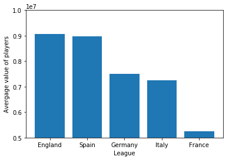


```python
#Player value per position
position_list = {
    'Forward' : ['CF', 'LF', 'LS', 'LW', 'RF', 'RS', 'RW', 'ST'],
    'Midfield' : ['CAM', 'CDM', 'CM', 'LAM', 'LCM', 'LDM', 'LM', 'RAM', 'RCB', 'RCM', 'RDM', 'RM'],
    'Backward' : ['CB', 'LB', 'LCB', 'LWB', 'RB', 'RCB', 'RWB'],
    'Goalkeeper' : ['GK'],
}
sum_per_position = {'Forward': 0, 'Midfield': 0, 'Backward': 0, 'Goalkeeper': 0}
player_per_position = {'Forward': 0, 'Midfield': 0, 'Backward': 0, 'Goalkeeper': 0}
average_per_position = {'Forward': 0, 'Midfield': 0, 'Backward': 0, 'Goalkeeper': 0}

def sum_values(series):
    already_counted = [0, 0, 0, 0] #Array to avoid having repeated values in the average
    preferred_position_list = re.sub("[^\w]", " ",  series[0]).split() #Split the preferred positions
    value = series[1]

    #Count the players per position category
    index = 0
    for preferred_position in preferred_position_list:
        for position in position_list:
            if preferred_position in position_list[position]:
                if(not already_counted[index]):
                    sum_per_position[position] += value
                    player_per_position[position] += 1                    
                    already_counted[index] = 1
                    
position_value = processed_df[['Preferred Positions', 'Value']]
position_value.apply(sum_values, 1)

#Average the players value per position category
for position in sum_per_position:
    average_per_position[position] = sum_per_position[position] / player_per_position[position]

fig = plt.figure(figsize=(6,4))
ax = fig.add_subplot(111)
ax.bar(range(len(average_per_position)), list(average_per_position.values()))
plt.xticks(range(len(average_per_position)), list(average_per_position.keys()))
plt.xlabel('Position')
plt.ylabel('Average value of players')
plt.show()
```


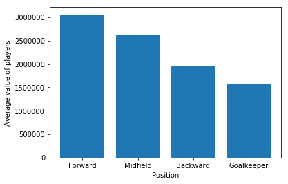


```python
#Versatility and value
skill_versatility = {1: [0, 0], 2: [0, 0], 3: [0, 0], 4: [0, 0]}
average = {1: 0, 2: 0, 3: 0, 4: 0}

def sum_values(series):
    preferred_position_list = re.sub("[^\w]", " ",  series[0]).split() #Split the preferred positions
    skill_count = len(preferred_position_list)
    value = series[1]

    #Count the players per versatility
    if (skill_count in skill_versatility):
        skill_versatility[skill_count][0] += 1
        skill_versatility[skill_count][1] += value  
                    
position_value = processed_df[['Preferred Positions', 'Value']]
position_value.apply(sum_values, 1)

#Average the players value per position count
for count in skill_versatility:
    average[count] = skill_versatility[count][1] / skill_versatility[count][0]

fig = plt.figure(figsize=(6,4))
ax = fig.add_subplot(111)
ax.bar(range(len(average)), list(average.values()))
plt.xticks(range(len(average)), list(average.keys()))
plt.xlabel('Number of possible positions')
plt.ylabel('Average value of players')
ax.set(ylim=(2000000, 3500000))
plt.show()
```


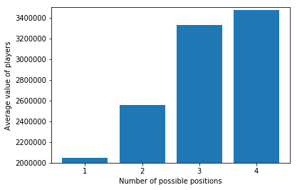


```python
#Player value per skill
fig = plt.figure(figsize=(6,4))
sns.set(style="ticks")
test = pd.DataFrame(np.c_[processed_df['Value'], processed_df['Acceleration'], processed_df['Aggression'], processed_df['Agility'], processed_df['Balance'],
                          processed_df['Ball control'], processed_df['Composure'],processed_df["Crossing"],processed_df['Curve'], processed_df['Dribbling'],
                          processed_df['Finishing'], processed_df['Free kick accuracy'], processed_df['GK diving'], processed_df['GK handling'], processed_df['GK kicking'],
                          processed_df['GK positioning'], processed_df['GK reflexes'], processed_df['Heading accuracy'], processed_df['Interceptions'], processed_df['Jumping'],
                          processed_df['Long passing'], processed_df['Long shots'], processed_df['Marking'], processed_df['Penalties'], processed_df['Positioning'],
                          processed_df['Reactions'], processed_df['Short passing'], processed_df['Shot power'], processed_df['Sliding tackle'], processed_df['Sprint speed'], 
                          processed_df['Stamina'], processed_df['Standing tackle'], processed_df['Strength'], processed_df['Vision'], processed_df['Volleys'] ], 
                    columns=["Value", "Acceleration", "Aggression", "Agility", "Balance", "Ball control", "Composure", "Crossing", "Curve", "Dribbling", "Finishing", "Free kick accuracy", "GK diving",
                             "GK handling", "GK kicking", "GK positioning", "GK reflexes", "Heading accuracy", "Interceptions", "Jumping", "Long passing", "Long shots", "Marking", "Penalties", "Positioning",
                             "Reactions", "Short passing", "Shot power", "Sliding tackle", "Sprint speed", "Stamina", "Standing tackle", "Strength", "Vision","Volleys"])
test = test.melt('Value', var_name='Skills',  value_name='Score')
g = sns.lmplot(y="Value", x="Score", hue='Skills', col="Skills", data=test, col_wrap=2)
plt.show()
```


    <Figure size 432x288 with 0 Axes>


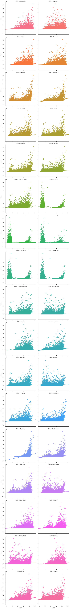


```python
#Potential and Value
# Selecting unique Age from DataFrame
potential = dataset.sort_values("Potential")['Potential'].unique()
# Selecting mean Overall from DataFrame
overall = dataset.sort_values("Overall")['Overall'].unique()
# Selecting mean value from DataFrame
value = dataset.groupby("Potential")["Value"].mean().values

plt.figure(figsize=(8,6))
plt.title('Mean Value vs Potential Rating', fontsize=20, fontweight='bold')
plt.xlabel('Potential', fontsize=15)
plt.ylabel('Player Value', fontsize=15)
sns.set_style("whitegrid")
plt.plot(potential, value, label="Value")
plt.legend(loc=4, prop={'size': 15}, frameon=True,shadow=True, facecolor="white", edgecolor="black")
plt.show()
```


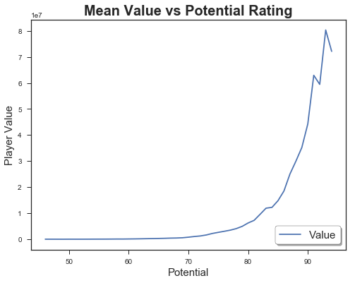


```python
#Overall and Value
# Selecting unique Age from DataFrame
overall = dataset.sort_values("Overall")['Overall'].unique()
# Selecting mean Overall from DataFrame
value = dataset.groupby("Overall")["Value"].mean().values

plt.figure(figsize=(8,6))
plt.title('Mean Value vs Overall Rating', fontsize=20, fontweight='bold')
plt.xlabel('Overall', fontsize=15)
plt.ylabel('Player Value', fontsize=15)
sns.set_style("whitegrid")
plt.plot(overall, value, label="Value")
plt.legend(loc=4, prop={'size': 15}, frameon=True,shadow=True, facecolor="white", edgecolor="black")
plt.show()
```


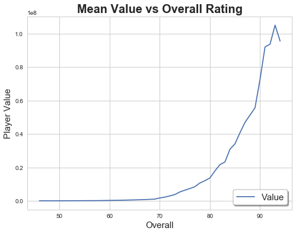


```python
#Age and value
# Selecting unique Age from DataFrame
age = dataset.sort_values("Age")['Age'].unique()
# Selecting mean Overall from DataFrame
value = dataset.groupby("Age")["Value"].mean().values

plt.figure(figsize=(8,6))
plt.title('Mean Value vs Age', fontsize=20, fontweight='bold')
plt.xlabel('Age', fontsize=15)
plt.ylabel('Player Value', fontsize=15)
sns.set_style("whitegrid")
plt.plot(age, value, label="Value")
plt.legend(loc=4, prop={'size': 15}, frameon=True,shadow=True, facecolor="white", edgecolor="black")
plt.show()
```


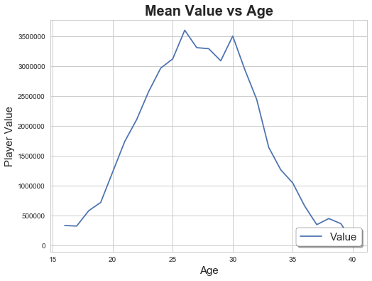


Interestingly, players with more offensive playstyles are more expensive than defensive ones. Even though both positions are equally important, a bias on the transfer market values one more than the other (maybe because they have better marketting value for advertisements, jersey sales which unfortunately is not contained in the dataset).<br/>
Versatility is also a valueable asset because it enables a coach to have more freedom for team management.<br/>
Obviously the better a player's overall rating the greater his transfer value. But less obviously, players with high potential values are very expenssive too because teams see them as an investment.

### Player Overall and Potential Rating


```python
#Age and quality
#Age and potential
# Selecting players with age smaller then 40 
dataset = processed_df.loc[processed_df['Age'] <= 40]
# Selecting unique Age from DataFrame
age = dataset.sort_values("Age")['Age'].unique()
# Selecting mean Overall from DataFrame
overall = dataset.groupby("Age")["Overall"].mean().values
# Selecting mean Potential from DataFrame
potential = dataset.groupby("Age")["Potential"].mean().values

plt.figure(figsize=(10,6))
plt.title('Mean Overall/Potential Rating vs Age', fontsize=20, fontweight='bold')
plt.xlabel('Player Age', fontsize=15)
plt.ylabel('Player Rating', fontsize=15)
sns.set_style("whitegrid")
plt.plot(age, overall, label="Overall")
plt.plot(age, potential, label="Potential")
plt.legend(loc=4, prop={'size': 15}, frameon=True,shadow=True, facecolor="white", edgecolor="black")
plt.show()
```


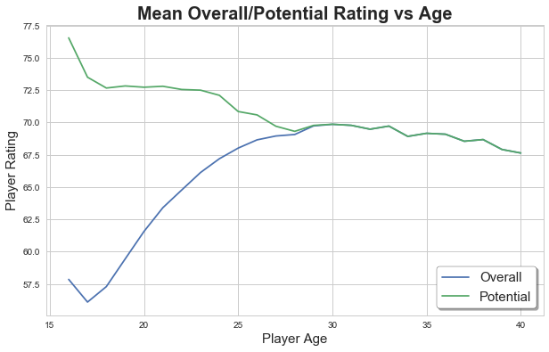


```python
#Maximum player overall score per country
country_overall = dataset.groupby("Nationality")["Overall"].max()
country_overall = country_overall.reset_index()

data = [ dict(
        type = 'choropleth',
        locationmode = "country names",
        locations = country_overall['Nationality'],
        z = country_overall['Overall'],
        colorscale = [[55,"rgb(5, 10, 172)"],[59,"rgb(40, 60, 190)"],[63,"rgb(70, 100, 245)"],\
            [67,"rgb(90, 120, 245)"],[71,"rgb(106, 137, 247)"],[75,"rgb(220, 220, 220)"]],
        autocolorscale = False,
        reversescale = True,
        marker = dict(
            line = dict (
                color = 'rgb(180,180,180)',
                width = 0.5
            ) ),
        colorbar = dict(
            autotick = False,
            title = 'Maximum<br>Overall Score'),
      ) ]

layout = dict(
    title = 'Player Quality',
    geo = dict(
        showframe = False,
        showcoastlines = False,
        projection = dict(
            type = 'Mercator'
        )
    )
)

fig = dict( data=data, layout=layout )
py.iplot( fig, validate=False )
```


<iframe id="igraph" scrolling="no" style="border:none;" seamless="seamless" src="https://plot.ly/~Fournierp/56.embed" height="525px" width="100%"></iframe>


```python
#Maximum player potential score per country
country_potential = dataset.groupby("Nationality")["Potential"].max()
country_potential = country_potential.reset_index()

data = [ dict(
        type = 'choropleth',
        locationmode = "country names",
        locations = country_potential['Nationality'],
        z = country_potential['Potential'],
        colorscale = [[65,"rgb(5, 10, 172)"],[67,"rgb(40, 60, 190)"],[69,"rgb(70, 100, 245)"],\
            [71,"rgb(90, 120, 245)"],[73,"rgb(106, 137, 247)"],[75,"rgb(220, 220, 220)"]],
        autocolorscale = False,
        reversescale = True,
        marker = dict(
            line = dict (
                color = 'rgb(180,180,180)',
                width = 0.5
            ) ),
        colorbar = dict(
            autotick = False,
            title = 'Maximum<br>Potential Score'),
      ) ]

layout = dict(
    title = 'Player Potential',
    geo = dict(
        showframe = False,
        showcoastlines = False,
        projection = dict(
            type = 'Mercator'
        )
    )
)

fig = dict( data=data, layout=layout )
py.iplot( fig, validate=False )
```


<iframe id="igraph" scrolling="no" style="border:none;" seamless="seamless" src="https://plot.ly/~Fournierp/58.embed" height="525px" width="100%"></iframe>


The main football hubs seem to be South America and Western Europe.

### Clubs


```python
#Team value
club_value = dataset.groupby("Club")["Value"].sum()
club_value = club_value.reset_index()

sns.set(style="whitegrid")
# Initialize the matplotlib figure
f, ax = plt.subplots(figsize=(8, 10))

# Plot the total crashes
sns.set_color_codes("pastel")
sns.barplot(y=club_value.nlargest(20, "Value")["Club"], x=club_value.nlargest(20, "Value")["Value"], data=club_value,
            label="Total", color="b")
ax.set(xlim=(3e8, 9e8))

sns.despine(left=True, bottom=True)
```


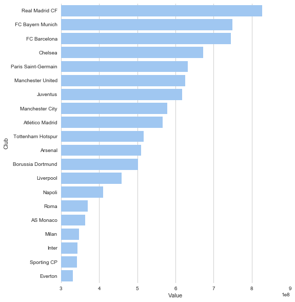


```python
#Team quality
club_overall = dataset.groupby("Club")["Overall"].mean()
club_overall = club_overall.reset_index()

sns.set(style="whitegrid")
# Initialize the matplotlib figure
f, ax = plt.subplots(figsize=(8, 10))

# Plot the total crashes
sns.set_color_codes("pastel")
sns.barplot(y=club_overall.nlargest(20, "Overall")["Club"], x=club_overall.nlargest(20, "Overall")["Overall"], data=club_overall,
            label="Total", color="b")
ax.set(xlim=(75, 85))
sns.despine(left=True, bottom=True)
```


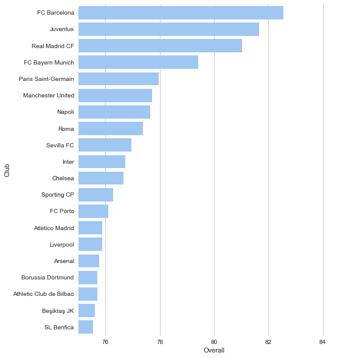


```python
#Team potential
club_potential = dataset.groupby("Club")["Potential"].mean()
club_potential = club_potential.reset_index()

sns.set(style="whitegrid")
# Initialize the matplotlib figure
f, ax = plt.subplots(figsize=(8, 10))

# Plot the total crashes
sns.set_color_codes("muted")
sns.barplot(y=club_potential.nlargest(20, "Potential")["Club"], x=club_potential.nlargest(20, "Potential")["Potential"], data=club_potential,
            label="Total", color="b")
ax.set(xlim=(75, 85))
sns.despine(left=True, bottom=True)
```


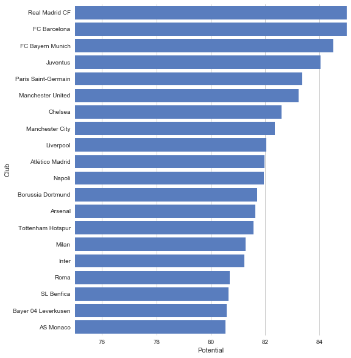


### Heatmaps
Let us look at the correlation between certain features.


```python
#Heatmap: show the correlation between similar features.
# Select a subset of the df
used_variables = ['Overall', 'Potential',
       'Value', 'Wage', 'Acceleration', 'Aggression', 'Agility', 'Balance',
       'Ball control', 'Composure', 'Crossing', 'Curve', 'Dribbling',
       'Finishing', 'Free kick accuracy', 'GK diving', 'GK handling',
       'GK kicking', 'GK positioning', 'GK reflexes', 'Heading accuracy',
       'Interceptions', 'Jumping', 'Long passing', 'Long shots', 'Marking',
       'Penalties', 'Positioning', 'Reactions', 'Short passing', 'Shot power',
       'Sliding tackle', 'Sprint speed', 'Stamina', 'Standing tackle',
       'Strength', 'Vision', 'Volleys']
used_columns = (processed_df.columns.get_level_values(None).isin(used_variables))
df = processed_df.loc[:, used_columns]

# Draw the full plot
plt.figure(figsize=(13,13))
sns.clustermap(df.corr(), center=0, cmap="vlag", linewidths=.75)

```


    <seaborn.matrix.ClusterGrid at 0x1a10c62710>


    <Figure size 936x936 with 0 Axes>


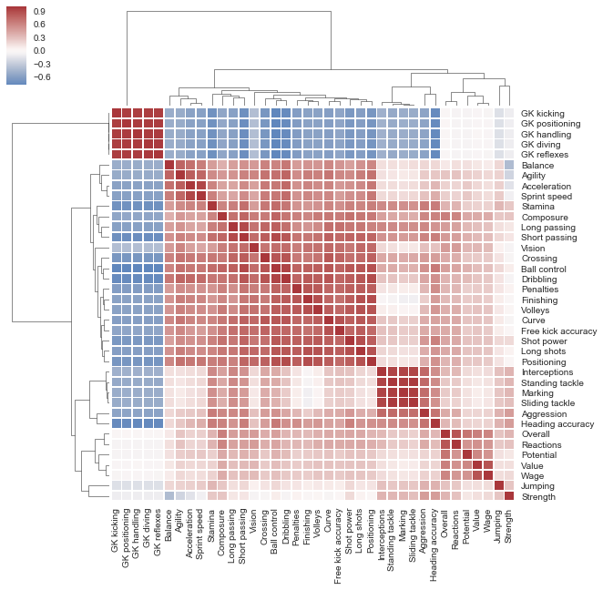


```python
#Heatmap
# Select a subset of the df
used_variables = ['Overall', 'Potential', 'Value', 'Wage', 'CAM',
                  'CB', 'CDM', 'CF', 'CM', 'LAM', 'LB', 'LCB', 'LCM',
                  'LDM', 'LF', 'LM', 'LS', 'LW', 'LWB','RAM', 'RB',
                  'RCB', 'RCM', 'RDM', 'RF', 'RM', 'RS', 'RW', 'RWB', 'ST']
used_columns = (processed_df.columns.get_level_values(None).isin(used_variables))
df = processed_df.loc[:, used_columns]

# Draw the full plot
plt.figure(figsize=(13,13))
sns.clustermap(df.corr(), center=0, cmap="vlag", linewidths=.75)
```


    <seaborn.matrix.ClusterGrid at 0x1a0fe62e48>


    <Figure size 936x936 with 0 Axes>


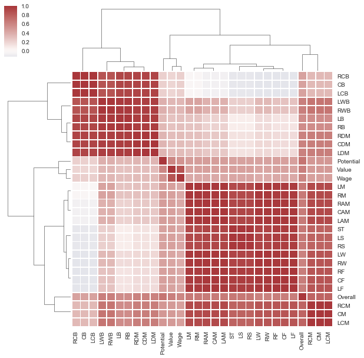


# Modeling
Now let us make a machine learning model to predict player transfer value and wage based on his characteristics
## Transfer Value 
Following our EDA, we saw that the nationality and club had little consequence over the player's value, and adding them to the model would add a lot of dimensions, so we can safely drop them.


```python
preprocessed_df = processed_df.copy()
preprocessed_df = preprocessed_df.drop(['Name', 'Nationality', 'Club'], 1)
preprocessed_df = preprocessed_df.drop(preprocessed_df.columns[0], 1)
#Separate x and y
y_value = preprocessed_df['Value'].copy()
y_wage = preprocessed_df['Wage'].copy()
preprocessed_df = preprocessed_df.drop(['Value', 'Wage'], 1)
```

As we have seen in the EDA, a player's versatility is valuable so we need to capture that in the model.


```python
# Add versatility to the model
def count_positions(position):
    return len(re.sub("[^\w]", " ",  position).split()) #Split the preferred positions

preprocessed_df['Versatility'] = preprocessed_df['Preferred Positions'].apply(count_positions)
preprocessed_df.head()
```


<div>
<style scoped>
    .dataframe tbody tr th:only-of-type {
        vertical-align: middle;
    }

    .dataframe tbody tr th {
        vertical-align: top;
    }

    .dataframe thead th {
        text-align: right;
    }
</style>
<table border="1" class="dataframe">
  <thead>
    <tr style="text-align: right;">
      <th></th>
      <th>Age</th>
      <th>Overall</th>
      <th>Potential</th>
      <th>Acceleration</th>
      <th>Aggression</th>
      <th>Agility</th>
      <th>Balance</th>
      <th>Ball control</th>
      <th>Composure</th>
      <th>Crossing</th>
      <th>...</th>
      <th>RCB</th>
      <th>RCM</th>
      <th>RDM</th>
      <th>RF</th>
      <th>RM</th>
      <th>RS</th>
      <th>RW</th>
      <th>RWB</th>
      <th>ST</th>
      <th>Versatility</th>
    </tr>
  </thead>
  <tbody>
    <tr>
      <th>0</th>
      <td>32</td>
      <td>94</td>
      <td>94</td>
      <td>89.0</td>
      <td>63.0</td>
      <td>89.0</td>
      <td>63.0</td>
      <td>93.0</td>
      <td>95.0</td>
      <td>85.0</td>
      <td>...</td>
      <td>53.0</td>
      <td>82.0</td>
      <td>62.0</td>
      <td>91.0</td>
      <td>89.0</td>
      <td>92.0</td>
      <td>91.0</td>
      <td>66.0</td>
      <td>92.0</td>
      <td>2</td>
    </tr>
    <tr>
      <th>1</th>
      <td>30</td>
      <td>93</td>
      <td>93</td>
      <td>92.0</td>
      <td>48.0</td>
      <td>90.0</td>
      <td>95.0</td>
      <td>95.0</td>
      <td>96.0</td>
      <td>77.0</td>
      <td>...</td>
      <td>45.0</td>
      <td>84.0</td>
      <td>59.0</td>
      <td>92.0</td>
      <td>90.0</td>
      <td>88.0</td>
      <td>91.0</td>
      <td>62.0</td>
      <td>88.0</td>
      <td>1</td>
    </tr>
    <tr>
      <th>2</th>
      <td>25</td>
      <td>92</td>
      <td>94</td>
      <td>94.0</td>
      <td>56.0</td>
      <td>96.0</td>
      <td>82.0</td>
      <td>95.0</td>
      <td>92.0</td>
      <td>75.0</td>
      <td>...</td>
      <td>46.0</td>
      <td>79.0</td>
      <td>59.0</td>
      <td>88.0</td>
      <td>87.0</td>
      <td>84.0</td>
      <td>89.0</td>
      <td>64.0</td>
      <td>84.0</td>
      <td>1</td>
    </tr>
    <tr>
      <th>3</th>
      <td>30</td>
      <td>92</td>
      <td>92</td>
      <td>88.0</td>
      <td>78.0</td>
      <td>86.0</td>
      <td>60.0</td>
      <td>91.0</td>
      <td>83.0</td>
      <td>77.0</td>
      <td>...</td>
      <td>58.0</td>
      <td>80.0</td>
      <td>65.0</td>
      <td>88.0</td>
      <td>85.0</td>
      <td>88.0</td>
      <td>87.0</td>
      <td>68.0</td>
      <td>88.0</td>
      <td>1</td>
    </tr>
    <tr>
      <th>4</th>
      <td>31</td>
      <td>92</td>
      <td>92</td>
      <td>58.0</td>
      <td>29.0</td>
      <td>52.0</td>
      <td>35.0</td>
      <td>48.0</td>
      <td>70.0</td>
      <td>15.0</td>
      <td>...</td>
      <td>NaN</td>
      <td>NaN</td>
      <td>NaN</td>
      <td>NaN</td>
      <td>NaN</td>
      <td>NaN</td>
      <td>NaN</td>
      <td>NaN</td>
      <td>NaN</td>
      <td>1</td>
    </tr>
  </tbody>
</table>
<p>5 rows × 65 columns</p>
</div>


```python
#Remove the initial one hot encoded column and remove space in columns to enable graphviz tree plotting
preprocessed_df = preprocessed_df.drop(['Preferred Positions'], 1)
preprocessed_df.columns = preprocessed_df.columns.str.replace('\s+', '_')
```


```python
#Train-Test split
X_train_value, X_test_value, y_train_value, y_test_value = train_test_split(preprocessed_df, y_value, test_size=0.2)
X_train_wage, X_test_wage, y_train_wage, y_test_wage = train_test_split(preprocessed_df, y_wage, test_size=0.2)
```


```python
#Create permutations of different hyperparameter combinations
num_boost_round = 999
early_stopping_rounds = 10

xgb_params = {
                'n_estimators':[500],
                # Other parameters
                'objective':['reg:linear'],
                'eval_metric':[ ["rmse" ,"mae"]],
                'min_child_weight': [1],
                'eta': [0.01, 0.1], #Learning rate
                'gamma': [0.05, 0.1], #Minimum acceptable entropy improvement to perform a split
                #Bias\variance tradeoff knobs
                'subsample': [0.8, 1.0],
                'colsample_bytree': [0.8, 1.0],
                'max_depth': [6, 9]
              }

params_perms = [dict(zip(xgb_params, v)) for v in product(*xgb_params.values())]
print(len(params_perms))
print(params_perms[0])
```

    32
    {'n_estimators': 500, 'objective': 'reg:linear', 'eval_metric': ['rmse', 'mae'], 'min_child_weight': 1, 'eta': 0.01, 'gamma': 0.05, 'subsample': 0.8, 'colsample_bytree': 0.8, 'max_depth': 6}


```python
dtrain_value = xgb.DMatrix(X_train_value, label=y_train_value)
dtest_value = xgb.DMatrix(X_test_value, label=y_test_value)
evaluation_set_value = [(dtest_value, "Test_set")]
```

### Create Baseline Model for Comparison (Average)


```python
mean_train_value = np.mean(y_train_value)

# Get predictions on the test set
baseline_predictions_value = np.ones(y_test_value.shape) * mean_train_value

# Compute MAE
mae_baseline_value = mean_absolute_error(y_test_value, baseline_predictions_value)

# Compute RMSE
rmse_baseline_value = sqrt(mean_squared_error(y_test_value, baseline_predictions_value))

print("Baseline MAE is {:.2f}".format(mae_baseline_value))
print("Baseline RMSE is {:.2f}".format(rmse_baseline_value))
```

    Baseline MAE is 2667872.59
    Baseline RMSE is 5546104.58


### Grid Search for Best Parameters


```python
best_score_value = mae_baseline_value
best_params_value = {}
for i, grid_search_value in enumerate(params_perms):
    print("Permutation number:", i+1)
    cv_results_value = xgb.cv(grid_search_value,
                        dtrain_value,
                        num_boost_round=num_boost_round,
                        seed=42,
                        nfold=2,
                        metrics=['mae', 'rmse'],
                        early_stopping_rounds=early_stopping_rounds
                        )
    
    mean_mae_value = cv_results_value['test-mae-mean'].min()
    boost_rounds_value = cv_results_value['test-mae-mean'].argmin()
    print("\tMAE {} for {} rounds".format(mean_mae_value, boost_rounds_value))
    if mean_mae_value < best_score_value:
        best_score_value = mean_mae_value
        best_params_value = grid_search_value
```

    Permutation number: 1


    /Users/paulfournier/anaconda3/lib/python3.6/site-packages/ipykernel_launcher.py:15: FutureWarning:
    
    'argmin' is deprecated, use 'idxmin' instead. The behavior of 'argmin'
    will be corrected to return the positional minimum in the future.
    Use 'series.values.argmin' to get the position of the minimum now.
    


    	MAE 174504.546875 for 998 rounds
    Permutation number: 2
    	MAE 170021.6328125 for 998 rounds
    Permutation number: 3
    	MAE 168309.1015625 for 994 rounds
    Permutation number: 4
    	MAE 162653.5078125 for 998 rounds
    Permutation number: 5
    	MAE 181790.84375 for 988 rounds
    Permutation number: 6
    	MAE 179391.8125 for 997 rounds
    Permutation number: 7
    	MAE 180445.7578125 for 986 rounds
    Permutation number: 8
    	MAE 176495.8828125 for 998 rounds
    Permutation number: 9
    	MAE 174504.546875 for 998 rounds
    Permutation number: 10
    	MAE 170021.6328125 for 998 rounds
    Permutation number: 11
    	MAE 168309.1015625 for 994 rounds
    Permutation number: 12
    	MAE 162653.5078125 for 998 rounds
    Permutation number: 13
    	MAE 181790.84375 for 988 rounds
    Permutation number: 14
    	MAE 179391.8125 for 997 rounds
    Permutation number: 15
    	MAE 180445.7578125 for 986 rounds
    Permutation number: 16
    	MAE 176495.8828125 for 998 rounds
    Permutation number: 17
    	MAE 190592.0078125 for 148 rounds
    Permutation number: 18
    	MAE 191342.3828125 for 136 rounds
    Permutation number: 19
    	MAE 180250.8359375 for 117 rounds
    Permutation number: 20
    	MAE 172040.6875 for 145 rounds
    Permutation number: 21
    	MAE 194313.0078125 for 93 rounds
    Permutation number: 22
    	MAE 195373.3984375 for 154 rounds
    Permutation number: 23
    	MAE 187728.1640625 for 91 rounds
    Permutation number: 24
    	MAE 179409.046875 for 122 rounds
    Permutation number: 25
    	MAE 190592.0078125 for 148 rounds
    Permutation number: 26
    	MAE 191342.3828125 for 136 rounds
    Permutation number: 27
    	MAE 180250.8359375 for 117 rounds
    Permutation number: 28
    	MAE 172040.6875 for 145 rounds
    Permutation number: 29
    	MAE 194313.0078125 for 93 rounds
    Permutation number: 30
    	MAE 195373.3984375 for 154 rounds
    Permutation number: 31
    	MAE 187728.1640625 for 91 rounds
    Permutation number: 32
    	MAE 179409.046875 for 122 rounds


```python
print("Best Score:", best_score_value)
print("Best Parameters:", best_params_value)
```

    Best Score: 162653.5078125
    Best Parameters: {'n_estimators': 500, 'objective': 'reg:linear', 'eval_metric': ['rmse', 'mae'], 'min_child_weight': 1, 'eta': 0.01, 'gamma': 0.05, 'subsample': 0.8, 'colsample_bytree': 1.0, 'max_depth': 9}


### Retrain the Model with the Best Parameters


```python
#Retrain a model with new best params
model_value = xgb.train(
    best_params_value,
    dtrain_value,
    num_boost_round=num_boost_round,
    evals=evaluation_set_value,
    early_stopping_rounds=early_stopping_rounds
)
```

    [0]	Test_set-rmse:5.98113e+06	Test_set-mae:2.35589e+06
    Multiple eval metrics have been passed: 'Test_set-mae' will be used for early stopping.
    
    Will train until Test_set-mae hasn't improved in 10 rounds.
    [1]	Test_set-rmse:5.92531e+06	Test_set-mae:2.33314e+06
    [2]	Test_set-rmse:5.87042e+06	Test_set-mae:2.31068e+06
    [3]	Test_set-rmse:5.81869e+06	Test_set-mae:2.28876e+06
    [4]	Test_set-rmse:5.76722e+06	Test_set-mae:2.26682e+06
    [5]	Test_set-rmse:5.71312e+06	Test_set-mae:2.24499e+06
    [6]	Test_set-rmse:5.66261e+06	Test_set-mae:2.22347e+06
    [7]	Test_set-rmse:5.61277e+06	Test_set-mae:2.20224e+06
    [8]	Test_set-rmse:5.56376e+06	Test_set-mae:2.18124e+06
    [9]	Test_set-rmse:5.5139e+06	Test_set-mae:2.16022e+06
    [10]	Test_set-rmse:5.46362e+06	Test_set-mae:2.13941e+06
    [11]	Test_set-rmse:5.41372e+06	Test_set-mae:2.11897e+06
    [12]	Test_set-rmse:5.36494e+06	Test_set-mae:2.09871e+06
    [13]	Test_set-rmse:5.31536e+06	Test_set-mae:2.07862e+06
    [14]	Test_set-rmse:5.26748e+06	Test_set-mae:2.05866e+06
    [15]	Test_set-rmse:5.22125e+06	Test_set-mae:2.03904e+06
    [16]	Test_set-rmse:5.17809e+06	Test_set-mae:2.01978e+06
    [17]	Test_set-rmse:5.13316e+06	Test_set-mae:2.00052e+06
    [18]	Test_set-rmse:5.08754e+06	Test_set-mae:1.98154e+06
    [19]	Test_set-rmse:5.04016e+06	Test_set-mae:1.96268e+06
    [20]	Test_set-rmse:4.9983e+06	Test_set-mae:1.94425e+06
    [21]	Test_set-rmse:4.95488e+06	Test_set-mae:1.92591e+06
    [22]	Test_set-rmse:4.91373e+06	Test_set-mae:1.90777e+06
    [23]	Test_set-rmse:4.86902e+06	Test_set-mae:1.88953e+06
    [24]	Test_set-rmse:4.82603e+06	Test_set-mae:1.87173e+06
    [25]	Test_set-rmse:4.78432e+06	Test_set-mae:1.85409e+06
    [26]	Test_set-rmse:4.74255e+06	Test_set-mae:1.83676e+06
    [27]	Test_set-rmse:4.70178e+06	Test_set-mae:1.81945e+06
    [28]	Test_set-rmse:4.66299e+06	Test_set-mae:1.80242e+06
    [29]	Test_set-rmse:4.62271e+06	Test_set-mae:1.78526e+06
    [30]	Test_set-rmse:4.58044e+06	Test_set-mae:1.76811e+06
    [31]	Test_set-rmse:4.54196e+06	Test_set-mae:1.75163e+06
    [32]	Test_set-rmse:4.50465e+06	Test_set-mae:1.73522e+06
    [33]	Test_set-rmse:4.46419e+06	Test_set-mae:1.71894e+06
    [34]	Test_set-rmse:4.42671e+06	Test_set-mae:1.70273e+06
    [35]	Test_set-rmse:4.38853e+06	Test_set-mae:1.6866e+06
    [36]	Test_set-rmse:4.35122e+06	Test_set-mae:1.67098e+06
    [37]	Test_set-rmse:4.31679e+06	Test_set-mae:1.6555e+06
    [38]	Test_set-rmse:4.28013e+06	Test_set-mae:1.64015e+06
    [39]	Test_set-rmse:4.24301e+06	Test_set-mae:1.62476e+06
    [40]	Test_set-rmse:4.2073e+06	Test_set-mae:1.60965e+06
    [41]	Test_set-rmse:4.17029e+06	Test_set-mae:1.59443e+06
    [42]	Test_set-rmse:4.1353e+06	Test_set-mae:1.57956e+06
    [43]	Test_set-rmse:4.0985e+06	Test_set-mae:1.56473e+06
    [44]	Test_set-rmse:4.06139e+06	Test_set-mae:1.54997e+06
    [45]	Test_set-rmse:4.02617e+06	Test_set-mae:1.53546e+06
    [46]	Test_set-rmse:3.99479e+06	Test_set-mae:1.52137e+06
    [47]	Test_set-rmse:3.96224e+06	Test_set-mae:1.50737e+06
    [48]	Test_set-rmse:3.92809e+06	Test_set-mae:1.49321e+06
    [49]	Test_set-rmse:3.89606e+06	Test_set-mae:1.4792e+06
    [50]	Test_set-rmse:3.86347e+06	Test_set-mae:1.46541e+06
    [51]	Test_set-rmse:3.82985e+06	Test_set-mae:1.45167e+06
    [52]	Test_set-rmse:3.79593e+06	Test_set-mae:1.43806e+06
    [53]	Test_set-rmse:3.76556e+06	Test_set-mae:1.42471e+06
    [54]	Test_set-rmse:3.73456e+06	Test_set-mae:1.41147e+06
    [55]	Test_set-rmse:3.70317e+06	Test_set-mae:1.39845e+06
    [56]	Test_set-rmse:3.67186e+06	Test_set-mae:1.38546e+06
    [57]	Test_set-rmse:3.63909e+06	Test_set-mae:1.37245e+06
    [58]	Test_set-rmse:3.60796e+06	Test_set-mae:1.35974e+06
    [59]	Test_set-rmse:3.58133e+06	Test_set-mae:1.34756e+06
    [60]	Test_set-rmse:3.55e+06	Test_set-mae:1.33499e+06
    [61]	Test_set-rmse:3.5228e+06	Test_set-mae:1.32292e+06
    [62]	Test_set-rmse:3.49168e+06	Test_set-mae:1.31055e+06
    [63]	Test_set-rmse:3.46282e+06	Test_set-mae:1.29845e+06
    [64]	Test_set-rmse:3.43577e+06	Test_set-mae:1.28654e+06
    [65]	Test_set-rmse:3.40887e+06	Test_set-mae:1.27477e+06
    [66]	Test_set-rmse:3.38104e+06	Test_set-mae:1.26313e+06
    [67]	Test_set-rmse:3.35432e+06	Test_set-mae:1.25171e+06
    [68]	Test_set-rmse:3.32527e+06	Test_set-mae:1.23994e+06
    [69]	Test_set-rmse:3.29682e+06	Test_set-mae:1.2285e+06
    [70]	Test_set-rmse:3.26781e+06	Test_set-mae:1.21699e+06
    [71]	Test_set-rmse:3.2405e+06	Test_set-mae:1.20583e+06
    [72]	Test_set-rmse:3.21462e+06	Test_set-mae:1.19472e+06
    [73]	Test_set-rmse:3.18785e+06	Test_set-mae:1.18368e+06
    [74]	Test_set-rmse:3.16107e+06	Test_set-mae:1.1728e+06
    [75]	Test_set-rmse:3.1355e+06	Test_set-mae:1.1621e+06
    [76]	Test_set-rmse:3.11025e+06	Test_set-mae:1.1515e+06
    [77]	Test_set-rmse:3.08328e+06	Test_set-mae:1.14074e+06
    [78]	Test_set-rmse:3.05658e+06	Test_set-mae:1.13023e+06
    [79]	Test_set-rmse:3.03159e+06	Test_set-mae:1.11976e+06
    [80]	Test_set-rmse:3.00679e+06	Test_set-mae:1.10957e+06
    [81]	Test_set-rmse:2.98196e+06	Test_set-mae:1.09957e+06
    [82]	Test_set-rmse:2.95653e+06	Test_set-mae:1.08944e+06
    [83]	Test_set-rmse:2.93241e+06	Test_set-mae:1.07953e+06
    [84]	Test_set-rmse:2.90937e+06	Test_set-mae:1.06991e+06
    [85]	Test_set-rmse:2.88518e+06	Test_set-mae:1.05997e+06
    [86]	Test_set-rmse:2.86107e+06	Test_set-mae:1.05026e+06
    [87]	Test_set-rmse:2.8395e+06	Test_set-mae:1.04077e+06
    [88]	Test_set-rmse:2.81644e+06	Test_set-mae:1.03137e+06
    [89]	Test_set-rmse:2.79248e+06	Test_set-mae:1.02194e+06
    [90]	Test_set-rmse:2.77023e+06	Test_set-mae:1.0126e+06
    [91]	Test_set-rmse:2.74976e+06	Test_set-mae:1.00345e+06
    [92]	Test_set-rmse:2.72795e+06	Test_set-mae:994442
    [93]	Test_set-rmse:2.70677e+06	Test_set-mae:985655
    [94]	Test_set-rmse:2.68687e+06	Test_set-mae:977010
    [95]	Test_set-rmse:2.6656e+06	Test_set-mae:968130
    [96]	Test_set-rmse:2.64451e+06	Test_set-mae:959399
    [97]	Test_set-rmse:2.62438e+06	Test_set-mae:950727
    [98]	Test_set-rmse:2.60361e+06	Test_set-mae:942321
    [99]	Test_set-rmse:2.58424e+06	Test_set-mae:933889
    [100]	Test_set-rmse:2.56465e+06	Test_set-mae:925734
    [101]	Test_set-rmse:2.54669e+06	Test_set-mae:917666
    [102]	Test_set-rmse:2.52666e+06	Test_set-mae:909403
    [103]	Test_set-rmse:2.50736e+06	Test_set-mae:901242
    [104]	Test_set-rmse:2.48937e+06	Test_set-mae:893201
    [105]	Test_set-rmse:2.47121e+06	Test_set-mae:885332
    [106]	Test_set-rmse:2.45107e+06	Test_set-mae:877286
    [107]	Test_set-rmse:2.43412e+06	Test_set-mae:869597
    [108]	Test_set-rmse:2.41511e+06	Test_set-mae:861784
    [109]	Test_set-rmse:2.39824e+06	Test_set-mae:854177
    [110]	Test_set-rmse:2.37959e+06	Test_set-mae:846527
    [111]	Test_set-rmse:2.36192e+06	Test_set-mae:839070
    [112]	Test_set-rmse:2.34474e+06	Test_set-mae:831772
    [113]	Test_set-rmse:2.32834e+06	Test_set-mae:824422
    [114]	Test_set-rmse:2.31213e+06	Test_set-mae:817154
    [115]	Test_set-rmse:2.29473e+06	Test_set-mae:809950
    [116]	Test_set-rmse:2.27724e+06	Test_set-mae:802679
    [117]	Test_set-rmse:2.26024e+06	Test_set-mae:795632
    [118]	Test_set-rmse:2.2439e+06	Test_set-mae:788647
    [119]	Test_set-rmse:2.22872e+06	Test_set-mae:781737
    [120]	Test_set-rmse:2.2123e+06	Test_set-mae:774851
    [121]	Test_set-rmse:2.19678e+06	Test_set-mae:768048
    [122]	Test_set-rmse:2.1812e+06	Test_set-mae:761283
    [123]	Test_set-rmse:2.16503e+06	Test_set-mae:754663
    [124]	Test_set-rmse:2.1486e+06	Test_set-mae:747910
    [125]	Test_set-rmse:2.13311e+06	Test_set-mae:741425
    [126]	Test_set-rmse:2.11712e+06	Test_set-mae:734927
    [127]	Test_set-rmse:2.10141e+06	Test_set-mae:728506
    [128]	Test_set-rmse:2.08642e+06	Test_set-mae:722196
    [129]	Test_set-rmse:2.07236e+06	Test_set-mae:715945
    [130]	Test_set-rmse:2.05785e+06	Test_set-mae:709807
    [131]	Test_set-rmse:2.04302e+06	Test_set-mae:703696
    [132]	Test_set-rmse:2.02896e+06	Test_set-mae:697596
    [133]	Test_set-rmse:2.01499e+06	Test_set-mae:691443
    [134]	Test_set-rmse:2.00057e+06	Test_set-mae:685423
    [135]	Test_set-rmse:1.98625e+06	Test_set-mae:679349
    [136]	Test_set-rmse:1.97266e+06	Test_set-mae:673420
    [137]	Test_set-rmse:1.95866e+06	Test_set-mae:667609
    [138]	Test_set-rmse:1.9439e+06	Test_set-mae:661737
    [139]	Test_set-rmse:1.93017e+06	Test_set-mae:656005
    [140]	Test_set-rmse:1.91631e+06	Test_set-mae:650385
    [141]	Test_set-rmse:1.90319e+06	Test_set-mae:644806
    [142]	Test_set-rmse:1.88994e+06	Test_set-mae:639180
    [143]	Test_set-rmse:1.877e+06	Test_set-mae:633623
    [144]	Test_set-rmse:1.86389e+06	Test_set-mae:628103
    [145]	Test_set-rmse:1.85297e+06	Test_set-mae:622925
    [146]	Test_set-rmse:1.84038e+06	Test_set-mae:617592
    [147]	Test_set-rmse:1.82755e+06	Test_set-mae:612254
    [148]	Test_set-rmse:1.81506e+06	Test_set-mae:607040
    [149]	Test_set-rmse:1.80284e+06	Test_set-mae:601959
    [150]	Test_set-rmse:1.79056e+06	Test_set-mae:596780
    [151]	Test_set-rmse:1.78027e+06	Test_set-mae:591770
    [152]	Test_set-rmse:1.76821e+06	Test_set-mae:586661
    [153]	Test_set-rmse:1.75561e+06	Test_set-mae:581652
    [154]	Test_set-rmse:1.74434e+06	Test_set-mae:576748
    [155]	Test_set-rmse:1.73258e+06	Test_set-mae:571804
    [156]	Test_set-rmse:1.72129e+06	Test_set-mae:567023
    [157]	Test_set-rmse:1.71016e+06	Test_set-mae:562266
    [158]	Test_set-rmse:1.69897e+06	Test_set-mae:557546
    [159]	Test_set-rmse:1.68811e+06	Test_set-mae:552801
    [160]	Test_set-rmse:1.67787e+06	Test_set-mae:548196
    [161]	Test_set-rmse:1.66803e+06	Test_set-mae:543656
    [162]	Test_set-rmse:1.65741e+06	Test_set-mae:539090
    [163]	Test_set-rmse:1.64722e+06	Test_set-mae:534574
    [164]	Test_set-rmse:1.638e+06	Test_set-mae:530228
    [165]	Test_set-rmse:1.62773e+06	Test_set-mae:525776
    [166]	Test_set-rmse:1.61772e+06	Test_set-mae:521343
    [167]	Test_set-rmse:1.60886e+06	Test_set-mae:517110
    [168]	Test_set-rmse:1.59855e+06	Test_set-mae:512832
    [169]	Test_set-rmse:1.58942e+06	Test_set-mae:508678
    [170]	Test_set-rmse:1.57939e+06	Test_set-mae:504433
    [171]	Test_set-rmse:1.57005e+06	Test_set-mae:500278
    [172]	Test_set-rmse:1.56019e+06	Test_set-mae:496126
    [173]	Test_set-rmse:1.55107e+06	Test_set-mae:492048
    [174]	Test_set-rmse:1.54151e+06	Test_set-mae:487990
    [175]	Test_set-rmse:1.53325e+06	Test_set-mae:484101
    [176]	Test_set-rmse:1.52375e+06	Test_set-mae:480052
    [177]	Test_set-rmse:1.51386e+06	Test_set-mae:476125
    [178]	Test_set-rmse:1.50428e+06	Test_set-mae:472186
    [179]	Test_set-rmse:1.49662e+06	Test_set-mae:468398
    [180]	Test_set-rmse:1.48814e+06	Test_set-mae:464590
    [181]	Test_set-rmse:1.47913e+06	Test_set-mae:460772
    [182]	Test_set-rmse:1.47183e+06	Test_set-mae:457133
    [183]	Test_set-rmse:1.46344e+06	Test_set-mae:453512
    [184]	Test_set-rmse:1.45661e+06	Test_set-mae:449962
    [185]	Test_set-rmse:1.44838e+06	Test_set-mae:446351
    [186]	Test_set-rmse:1.43956e+06	Test_set-mae:442736
    [187]	Test_set-rmse:1.43172e+06	Test_set-mae:439259
    [188]	Test_set-rmse:1.42353e+06	Test_set-mae:435793
    [189]	Test_set-rmse:1.41526e+06	Test_set-mae:432441
    [190]	Test_set-rmse:1.40781e+06	Test_set-mae:429120
    [191]	Test_set-rmse:1.40004e+06	Test_set-mae:425844
    [192]	Test_set-rmse:1.39227e+06	Test_set-mae:422520
    [193]	Test_set-rmse:1.38502e+06	Test_set-mae:419253
    [194]	Test_set-rmse:1.37721e+06	Test_set-mae:416013
    [195]	Test_set-rmse:1.36992e+06	Test_set-mae:412816
    [196]	Test_set-rmse:1.3614e+06	Test_set-mae:409603
    [197]	Test_set-rmse:1.35467e+06	Test_set-mae:406528
    [198]	Test_set-rmse:1.34774e+06	Test_set-mae:403398
    [199]	Test_set-rmse:1.34033e+06	Test_set-mae:400278
    [200]	Test_set-rmse:1.334e+06	Test_set-mae:397304
    [201]	Test_set-rmse:1.32668e+06	Test_set-mae:394232
    [202]	Test_set-rmse:1.3198e+06	Test_set-mae:391265
    [203]	Test_set-rmse:1.31263e+06	Test_set-mae:388294
    [204]	Test_set-rmse:1.30537e+06	Test_set-mae:385316
    [205]	Test_set-rmse:1.29856e+06	Test_set-mae:382418
    [206]	Test_set-rmse:1.29143e+06	Test_set-mae:379448
    [207]	Test_set-rmse:1.28484e+06	Test_set-mae:376592
    [208]	Test_set-rmse:1.27862e+06	Test_set-mae:373793
    [209]	Test_set-rmse:1.27261e+06	Test_set-mae:371014
    [210]	Test_set-rmse:1.26687e+06	Test_set-mae:368279
    [211]	Test_set-rmse:1.26109e+06	Test_set-mae:365636
    [212]	Test_set-rmse:1.25477e+06	Test_set-mae:362964
    [213]	Test_set-rmse:1.24889e+06	Test_set-mae:360360
    [214]	Test_set-rmse:1.24307e+06	Test_set-mae:357744
    [215]	Test_set-rmse:1.23706e+06	Test_set-mae:355156
    [216]	Test_set-rmse:1.23147e+06	Test_set-mae:352656
    [217]	Test_set-rmse:1.2254e+06	Test_set-mae:350140
    [218]	Test_set-rmse:1.22036e+06	Test_set-mae:347803
    [219]	Test_set-rmse:1.21513e+06	Test_set-mae:345419
    [220]	Test_set-rmse:1.20905e+06	Test_set-mae:343041
    [221]	Test_set-rmse:1.20388e+06	Test_set-mae:340741
    [222]	Test_set-rmse:1.19821e+06	Test_set-mae:338430
    [223]	Test_set-rmse:1.19321e+06	Test_set-mae:336211
    [224]	Test_set-rmse:1.18771e+06	Test_set-mae:333958
    [225]	Test_set-rmse:1.18276e+06	Test_set-mae:331772
    [226]	Test_set-rmse:1.17731e+06	Test_set-mae:329572
    [227]	Test_set-rmse:1.17254e+06	Test_set-mae:327408
    [228]	Test_set-rmse:1.16656e+06	Test_set-mae:325096
    [229]	Test_set-rmse:1.16266e+06	Test_set-mae:322946
    [230]	Test_set-rmse:1.15784e+06	Test_set-mae:320821
    [231]	Test_set-rmse:1.15327e+06	Test_set-mae:318715
    [232]	Test_set-rmse:1.14805e+06	Test_set-mae:316592
    [233]	Test_set-rmse:1.1437e+06	Test_set-mae:314572
    [234]	Test_set-rmse:1.13834e+06	Test_set-mae:312496
    [235]	Test_set-rmse:1.13366e+06	Test_set-mae:310483
    [236]	Test_set-rmse:1.12837e+06	Test_set-mae:308460
    [237]	Test_set-rmse:1.12338e+06	Test_set-mae:306445
    [238]	Test_set-rmse:1.11949e+06	Test_set-mae:304540
    [239]	Test_set-rmse:1.11529e+06	Test_set-mae:302655
    [240]	Test_set-rmse:1.11089e+06	Test_set-mae:300766
    [241]	Test_set-rmse:1.10679e+06	Test_set-mae:298905
    [242]	Test_set-rmse:1.10248e+06	Test_set-mae:297085
    [243]	Test_set-rmse:1.09835e+06	Test_set-mae:295258
    [244]	Test_set-rmse:1.09446e+06	Test_set-mae:293463
    [245]	Test_set-rmse:1.09057e+06	Test_set-mae:291687
    [246]	Test_set-rmse:1.08577e+06	Test_set-mae:289857
    [247]	Test_set-rmse:1.08183e+06	Test_set-mae:288018
    [248]	Test_set-rmse:1.078e+06	Test_set-mae:286299
    [249]	Test_set-rmse:1.07383e+06	Test_set-mae:284545
    [250]	Test_set-rmse:1.07019e+06	Test_set-mae:282813
    [251]	Test_set-rmse:1.06575e+06	Test_set-mae:281065
    [252]	Test_set-rmse:1.06154e+06	Test_set-mae:279336
    [253]	Test_set-rmse:1.05793e+06	Test_set-mae:277651
    [254]	Test_set-rmse:1.05388e+06	Test_set-mae:275968
    [255]	Test_set-rmse:1.05074e+06	Test_set-mae:274397
    [256]	Test_set-rmse:1.04736e+06	Test_set-mae:272815
    [257]	Test_set-rmse:1.04421e+06	Test_set-mae:271252
    [258]	Test_set-rmse:1.04126e+06	Test_set-mae:269727
    [259]	Test_set-rmse:1.03773e+06	Test_set-mae:268170
    [260]	Test_set-rmse:1.03438e+06	Test_set-mae:266649
    [261]	Test_set-rmse:1.03116e+06	Test_set-mae:265170
    [262]	Test_set-rmse:1.02813e+06	Test_set-mae:263704
    [263]	Test_set-rmse:1.0253e+06	Test_set-mae:262237
    [264]	Test_set-rmse:1.02234e+06	Test_set-mae:260835
    [265]	Test_set-rmse:1.01858e+06	Test_set-mae:259347
    [266]	Test_set-rmse:1.01582e+06	Test_set-mae:257945
    [267]	Test_set-rmse:1.01292e+06	Test_set-mae:256579
    [268]	Test_set-rmse:1.01049e+06	Test_set-mae:255214
    [269]	Test_set-rmse:1.00733e+06	Test_set-mae:253823
    [270]	Test_set-rmse:1.00406e+06	Test_set-mae:252439
    [271]	Test_set-rmse:1.00075e+06	Test_set-mae:251051
    [272]	Test_set-rmse:997826	Test_set-mae:249674
    [273]	Test_set-rmse:995536	Test_set-mae:248412
    [274]	Test_set-rmse:992966	Test_set-mae:247104
    [275]	Test_set-rmse:989730	Test_set-mae:245761
    [276]	Test_set-rmse:987333	Test_set-mae:244482
    [277]	Test_set-rmse:985009	Test_set-mae:243275
    [278]	Test_set-rmse:982053	Test_set-mae:242057
    [279]	Test_set-rmse:979974	Test_set-mae:240890
    [280]	Test_set-rmse:977288	Test_set-mae:239655
    [281]	Test_set-rmse:974698	Test_set-mae:238425
    [282]	Test_set-rmse:971193	Test_set-mae:237188
    [283]	Test_set-rmse:969203	Test_set-mae:236036
    [284]	Test_set-rmse:966818	Test_set-mae:234940
    [285]	Test_set-rmse:964921	Test_set-mae:233861
    [286]	Test_set-rmse:962697	Test_set-mae:232758
    [287]	Test_set-rmse:960904	Test_set-mae:231685
    [288]	Test_set-rmse:958430	Test_set-mae:230569
    [289]	Test_set-rmse:955842	Test_set-mae:229478
    [290]	Test_set-rmse:954191	Test_set-mae:228435
    [291]	Test_set-rmse:952397	Test_set-mae:227402
    [292]	Test_set-rmse:950374	Test_set-mae:226383
    [293]	Test_set-rmse:948211	Test_set-mae:225351
    [294]	Test_set-rmse:946272	Test_set-mae:224348
    [295]	Test_set-rmse:944539	Test_set-mae:223349
    [296]	Test_set-rmse:942748	Test_set-mae:222369
    [297]	Test_set-rmse:940299	Test_set-mae:221372
    [298]	Test_set-rmse:938714	Test_set-mae:220444
    [299]	Test_set-rmse:936830	Test_set-mae:219524
    [300]	Test_set-rmse:935249	Test_set-mae:218632
    [301]	Test_set-rmse:933404	Test_set-mae:217700
    [302]	Test_set-rmse:930972	Test_set-mae:216776
    [303]	Test_set-rmse:929335	Test_set-mae:215846
    [304]	Test_set-rmse:927328	Test_set-mae:214967
    [305]	Test_set-rmse:925321	Test_set-mae:214093
    [306]	Test_set-rmse:923513	Test_set-mae:213204
    [307]	Test_set-rmse:921748	Test_set-mae:212315
    [308]	Test_set-rmse:920361	Test_set-mae:211493
    [309]	Test_set-rmse:918581	Test_set-mae:210644
    [310]	Test_set-rmse:916278	Test_set-mae:209738
    [311]	Test_set-rmse:914405	Test_set-mae:208919
    [312]	Test_set-rmse:912322	Test_set-mae:208075
    [313]	Test_set-rmse:910462	Test_set-mae:207280
    [314]	Test_set-rmse:908982	Test_set-mae:206484
    [315]	Test_set-rmse:907467	Test_set-mae:205669
    [316]	Test_set-rmse:906231	Test_set-mae:204931
    [317]	Test_set-rmse:904426	Test_set-mae:204195
    [318]	Test_set-rmse:902901	Test_set-mae:203422
    [319]	Test_set-rmse:901806	Test_set-mae:202710
    [320]	Test_set-rmse:900436	Test_set-mae:202027
    [321]	Test_set-rmse:898913	Test_set-mae:201297
    [322]	Test_set-rmse:897652	Test_set-mae:200611
    [323]	Test_set-rmse:896210	Test_set-mae:199929
    [324]	Test_set-rmse:894280	Test_set-mae:199197
    [325]	Test_set-rmse:892978	Test_set-mae:198484
    [326]	Test_set-rmse:891596	Test_set-mae:197795
    [327]	Test_set-rmse:890639	Test_set-mae:197188
    [328]	Test_set-rmse:888809	Test_set-mae:196504
    [329]	Test_set-rmse:887238	Test_set-mae:195829
    [330]	Test_set-rmse:885715	Test_set-mae:195123
    [331]	Test_set-rmse:884560	Test_set-mae:194493
    [332]	Test_set-rmse:883256	Test_set-mae:193871
    [333]	Test_set-rmse:882102	Test_set-mae:193255
    [334]	Test_set-rmse:881154	Test_set-mae:192696
    [335]	Test_set-rmse:880111	Test_set-mae:192126
    [336]	Test_set-rmse:878887	Test_set-mae:191511
    [337]	Test_set-rmse:877695	Test_set-mae:190940
    [338]	Test_set-rmse:875912	Test_set-mae:190325
    [339]	Test_set-rmse:874785	Test_set-mae:189799
    [340]	Test_set-rmse:873536	Test_set-mae:189238
    [341]	Test_set-rmse:872564	Test_set-mae:188720
    [342]	Test_set-rmse:871106	Test_set-mae:188163
    [343]	Test_set-rmse:870291	Test_set-mae:187678
    [344]	Test_set-rmse:869212	Test_set-mae:187170
    [345]	Test_set-rmse:868290	Test_set-mae:186674
    [346]	Test_set-rmse:867573	Test_set-mae:186168
    [347]	Test_set-rmse:866041	Test_set-mae:185663
    [348]	Test_set-rmse:864910	Test_set-mae:185157
    [349]	Test_set-rmse:864252	Test_set-mae:184706
    [350]	Test_set-rmse:863187	Test_set-mae:184201
    [351]	Test_set-rmse:862246	Test_set-mae:183720
    [352]	Test_set-rmse:861081	Test_set-mae:183231
    [353]	Test_set-rmse:860357	Test_set-mae:182800
    [354]	Test_set-rmse:858984	Test_set-mae:182321
    [355]	Test_set-rmse:858521	Test_set-mae:181900
    [356]	Test_set-rmse:857070	Test_set-mae:181441
    [357]	Test_set-rmse:856148	Test_set-mae:181003
    [358]	Test_set-rmse:855349	Test_set-mae:180585
    [359]	Test_set-rmse:854532	Test_set-mae:180161
    [360]	Test_set-rmse:853830	Test_set-mae:179756
    [361]	Test_set-rmse:852493	Test_set-mae:179308
    [362]	Test_set-rmse:851605	Test_set-mae:178915
    [363]	Test_set-rmse:850329	Test_set-mae:178481
    [364]	Test_set-rmse:849882	Test_set-mae:178103
    [365]	Test_set-rmse:848109	Test_set-mae:177584
    [366]	Test_set-rmse:846696	Test_set-mae:177155
    [367]	Test_set-rmse:845987	Test_set-mae:176818
    [368]	Test_set-rmse:845024	Test_set-mae:176424
    [369]	Test_set-rmse:844224	Test_set-mae:176047
    [370]	Test_set-rmse:843651	Test_set-mae:175700
    [371]	Test_set-rmse:842392	Test_set-mae:175295
    [372]	Test_set-rmse:841846	Test_set-mae:174977
    [373]	Test_set-rmse:841105	Test_set-mae:174644
    [374]	Test_set-rmse:840087	Test_set-mae:174294
    [375]	Test_set-rmse:838893	Test_set-mae:173925
    [376]	Test_set-rmse:838297	Test_set-mae:173598
    [377]	Test_set-rmse:837150	Test_set-mae:173241
    [378]	Test_set-rmse:835897	Test_set-mae:172851
    [379]	Test_set-rmse:834810	Test_set-mae:172515
    [380]	Test_set-rmse:833821	Test_set-mae:172188
    [381]	Test_set-rmse:833254	Test_set-mae:171894
    [382]	Test_set-rmse:832465	Test_set-mae:171579
    [383]	Test_set-rmse:831328	Test_set-mae:171259
    [384]	Test_set-rmse:830627	Test_set-mae:170940
    [385]	Test_set-rmse:830223	Test_set-mae:170653
    [386]	Test_set-rmse:829168	Test_set-mae:170330
    [387]	Test_set-rmse:828607	Test_set-mae:170048
    [388]	Test_set-rmse:828226	Test_set-mae:169787
    [389]	Test_set-rmse:827650	Test_set-mae:169529
    [390]	Test_set-rmse:826747	Test_set-mae:169248
    [391]	Test_set-rmse:826188	Test_set-mae:168958
    [392]	Test_set-rmse:825609	Test_set-mae:168677
    [393]	Test_set-rmse:825020	Test_set-mae:168403
    [394]	Test_set-rmse:824409	Test_set-mae:168153
    [395]	Test_set-rmse:823874	Test_set-mae:167906
    [396]	Test_set-rmse:823305	Test_set-mae:167636
    [397]	Test_set-rmse:822751	Test_set-mae:167421
    [398]	Test_set-rmse:822307	Test_set-mae:167183
    [399]	Test_set-rmse:821670	Test_set-mae:166929
    [400]	Test_set-rmse:821060	Test_set-mae:166684
    [401]	Test_set-rmse:820595	Test_set-mae:166473
    [402]	Test_set-rmse:819961	Test_set-mae:166237
    [403]	Test_set-rmse:819555	Test_set-mae:166018
    [404]	Test_set-rmse:819127	Test_set-mae:165827
    [405]	Test_set-rmse:818274	Test_set-mae:165576
    [406]	Test_set-rmse:817254	Test_set-mae:165314
    [407]	Test_set-rmse:816720	Test_set-mae:165102
    [408]	Test_set-rmse:816124	Test_set-mae:164882
    [409]	Test_set-rmse:815675	Test_set-mae:164674
    [410]	Test_set-rmse:815294	Test_set-mae:164486
    [411]	Test_set-rmse:815055	Test_set-mae:164295
    [412]	Test_set-rmse:814567	Test_set-mae:164094
    [413]	Test_set-rmse:814050	Test_set-mae:163886
    [414]	Test_set-rmse:813644	Test_set-mae:163670
    [415]	Test_set-rmse:813312	Test_set-mae:163507
    [416]	Test_set-rmse:812959	Test_set-mae:163309
    [417]	Test_set-rmse:812470	Test_set-mae:163132
    [418]	Test_set-rmse:811571	Test_set-mae:162915
    [419]	Test_set-rmse:811290	Test_set-mae:162744
    [420]	Test_set-rmse:810427	Test_set-mae:162530
    [421]	Test_set-rmse:810079	Test_set-mae:162366
    [422]	Test_set-rmse:809792	Test_set-mae:162211
    [423]	Test_set-rmse:809292	Test_set-mae:162048
    [424]	Test_set-rmse:808865	Test_set-mae:161880
    [425]	Test_set-rmse:808533	Test_set-mae:161732
    [426]	Test_set-rmse:808010	Test_set-mae:161557
    [427]	Test_set-rmse:807648	Test_set-mae:161420
    [428]	Test_set-rmse:807388	Test_set-mae:161286
    [429]	Test_set-rmse:806579	Test_set-mae:161078
    [430]	Test_set-rmse:806272	Test_set-mae:160954
    [431]	Test_set-rmse:805982	Test_set-mae:160811
    [432]	Test_set-rmse:805771	Test_set-mae:160689
    [433]	Test_set-rmse:804827	Test_set-mae:160467
    [434]	Test_set-rmse:804351	Test_set-mae:160305
    [435]	Test_set-rmse:804052	Test_set-mae:160164
    [436]	Test_set-rmse:803697	Test_set-mae:160024
    [437]	Test_set-rmse:803252	Test_set-mae:159875
    [438]	Test_set-rmse:803037	Test_set-mae:159749
    [439]	Test_set-rmse:802785	Test_set-mae:159631
    [440]	Test_set-rmse:802554	Test_set-mae:159502
    [441]	Test_set-rmse:802215	Test_set-mae:159365
    [442]	Test_set-rmse:801874	Test_set-mae:159213
    [443]	Test_set-rmse:801654	Test_set-mae:159102
    [444]	Test_set-rmse:801496	Test_set-mae:158965
    [445]	Test_set-rmse:800821	Test_set-mae:158793
    [446]	Test_set-rmse:800612	Test_set-mae:158680
    [447]	Test_set-rmse:800267	Test_set-mae:158533
    [448]	Test_set-rmse:799943	Test_set-mae:158399
    [449]	Test_set-rmse:799783	Test_set-mae:158294
    [450]	Test_set-rmse:799485	Test_set-mae:158188
    [451]	Test_set-rmse:799224	Test_set-mae:158096
    [452]	Test_set-rmse:798928	Test_set-mae:157972
    [453]	Test_set-rmse:798639	Test_set-mae:157853
    [454]	Test_set-rmse:798363	Test_set-mae:157754
    [455]	Test_set-rmse:798056	Test_set-mae:157634
    [456]	Test_set-rmse:797730	Test_set-mae:157508
    [457]	Test_set-rmse:797577	Test_set-mae:157417
    [458]	Test_set-rmse:797323	Test_set-mae:157311
    [459]	Test_set-rmse:796973	Test_set-mae:157228
    [460]	Test_set-rmse:796744	Test_set-mae:157120
    [461]	Test_set-rmse:796632	Test_set-mae:157032
    [462]	Test_set-rmse:796262	Test_set-mae:156920
    [463]	Test_set-rmse:796003	Test_set-mae:156829
    [464]	Test_set-rmse:795378	Test_set-mae:156709
    [465]	Test_set-rmse:795263	Test_set-mae:156644
    [466]	Test_set-rmse:795210	Test_set-mae:156584
    [467]	Test_set-rmse:795001	Test_set-mae:156493
    [468]	Test_set-rmse:794863	Test_set-mae:156420
    [469]	Test_set-rmse:794622	Test_set-mae:156322
    [470]	Test_set-rmse:794448	Test_set-mae:156228
    [471]	Test_set-rmse:794233	Test_set-mae:156134
    [472]	Test_set-rmse:793970	Test_set-mae:156055
    [473]	Test_set-rmse:793416	Test_set-mae:155918
    [474]	Test_set-rmse:793189	Test_set-mae:155813
    [475]	Test_set-rmse:793056	Test_set-mae:155745
    [476]	Test_set-rmse:792753	Test_set-mae:155653
    [477]	Test_set-rmse:792550	Test_set-mae:155568
    [478]	Test_set-rmse:792300	Test_set-mae:155487
    [479]	Test_set-rmse:792092	Test_set-mae:155407
    [480]	Test_set-rmse:791892	Test_set-mae:155336
    [481]	Test_set-rmse:791616	Test_set-mae:155248
    [482]	Test_set-rmse:791189	Test_set-mae:155141
    [483]	Test_set-rmse:791050	Test_set-mae:155062
    [484]	Test_set-rmse:790822	Test_set-mae:154990
    [485]	Test_set-rmse:790688	Test_set-mae:154917
    [486]	Test_set-rmse:790658	Test_set-mae:154864
    [487]	Test_set-rmse:790500	Test_set-mae:154796
    [488]	Test_set-rmse:790252	Test_set-mae:154726
    [489]	Test_set-rmse:790008	Test_set-mae:154652
    [490]	Test_set-rmse:789798	Test_set-mae:154587
    [491]	Test_set-rmse:789579	Test_set-mae:154528
    [492]	Test_set-rmse:789140	Test_set-mae:154437
    [493]	Test_set-rmse:788956	Test_set-mae:154371
    [494]	Test_set-rmse:788747	Test_set-mae:154291
    [495]	Test_set-rmse:788293	Test_set-mae:154175
    [496]	Test_set-rmse:788133	Test_set-mae:154122
    [497]	Test_set-rmse:788001	Test_set-mae:154058
    [498]	Test_set-rmse:787826	Test_set-mae:154008
    [499]	Test_set-rmse:787695	Test_set-mae:153962
    [500]	Test_set-rmse:787583	Test_set-mae:153917
    [501]	Test_set-rmse:787489	Test_set-mae:153866
    [502]	Test_set-rmse:787357	Test_set-mae:153814
    [503]	Test_set-rmse:787255	Test_set-mae:153766
    [504]	Test_set-rmse:787199	Test_set-mae:153721
    [505]	Test_set-rmse:787028	Test_set-mae:153667
    [506]	Test_set-rmse:786803	Test_set-mae:153603
    [507]	Test_set-rmse:786608	Test_set-mae:153533
    [508]	Test_set-rmse:786394	Test_set-mae:153474
    [509]	Test_set-rmse:786378	Test_set-mae:153426
    [510]	Test_set-rmse:785960	Test_set-mae:153335
    [511]	Test_set-rmse:785760	Test_set-mae:153265
    [512]	Test_set-rmse:785574	Test_set-mae:153192
    [513]	Test_set-rmse:785418	Test_set-mae:153142
    [514]	Test_set-rmse:785318	Test_set-mae:153099
    [515]	Test_set-rmse:784868	Test_set-mae:153017
    [516]	Test_set-rmse:784776	Test_set-mae:152967
    [517]	Test_set-rmse:784722	Test_set-mae:152920
    [518]	Test_set-rmse:784465	Test_set-mae:152878
    [519]	Test_set-rmse:784014	Test_set-mae:152802
    [520]	Test_set-rmse:783889	Test_set-mae:152769
    [521]	Test_set-rmse:783751	Test_set-mae:152731
    [522]	Test_set-rmse:783693	Test_set-mae:152707
    [523]	Test_set-rmse:783514	Test_set-mae:152662
    [524]	Test_set-rmse:783436	Test_set-mae:152620
    [525]	Test_set-rmse:783374	Test_set-mae:152591
    [526]	Test_set-rmse:783214	Test_set-mae:152542
    [527]	Test_set-rmse:782887	Test_set-mae:152466
    [528]	Test_set-rmse:782794	Test_set-mae:152437
    [529]	Test_set-rmse:782738	Test_set-mae:152406
    [530]	Test_set-rmse:782596	Test_set-mae:152362
    [531]	Test_set-rmse:782454	Test_set-mae:152317
    [532]	Test_set-rmse:782310	Test_set-mae:152279
    [533]	Test_set-rmse:781979	Test_set-mae:152209
    [534]	Test_set-rmse:781839	Test_set-mae:152166
    [535]	Test_set-rmse:781822	Test_set-mae:152153
    [536]	Test_set-rmse:781695	Test_set-mae:152120
    [537]	Test_set-rmse:781516	Test_set-mae:152080
    [538]	Test_set-rmse:781134	Test_set-mae:151996
    [539]	Test_set-rmse:781038	Test_set-mae:151956
    [540]	Test_set-rmse:780929	Test_set-mae:151931
    [541]	Test_set-rmse:780603	Test_set-mae:151869
    [542]	Test_set-rmse:780515	Test_set-mae:151844
    [543]	Test_set-rmse:780533	Test_set-mae:151835
    [544]	Test_set-rmse:780415	Test_set-mae:151809
    [545]	Test_set-rmse:780079	Test_set-mae:151736
    [546]	Test_set-rmse:779961	Test_set-mae:151715
    [547]	Test_set-rmse:779921	Test_set-mae:151685
    [548]	Test_set-rmse:779876	Test_set-mae:151656
    [549]	Test_set-rmse:779494	Test_set-mae:151594
    [550]	Test_set-rmse:779464	Test_set-mae:151566
    [551]	Test_set-rmse:779401	Test_set-mae:151542
    [552]	Test_set-rmse:779315	Test_set-mae:151516
    [553]	Test_set-rmse:779249	Test_set-mae:151490
    [554]	Test_set-rmse:779230	Test_set-mae:151474
    [555]	Test_set-rmse:778986	Test_set-mae:151421
    [556]	Test_set-rmse:778821	Test_set-mae:151378
    [557]	Test_set-rmse:778676	Test_set-mae:151345
    [558]	Test_set-rmse:778592	Test_set-mae:151323
    [559]	Test_set-rmse:778483	Test_set-mae:151299
    [560]	Test_set-rmse:778174	Test_set-mae:151239
    [561]	Test_set-rmse:778152	Test_set-mae:151229
    [562]	Test_set-rmse:778161	Test_set-mae:151228
    [563]	Test_set-rmse:777871	Test_set-mae:151185
    [564]	Test_set-rmse:777809	Test_set-mae:151157
    [565]	Test_set-rmse:777715	Test_set-mae:151131
    [566]	Test_set-rmse:777486	Test_set-mae:151087
    [567]	Test_set-rmse:777393	Test_set-mae:151070
    [568]	Test_set-rmse:777299	Test_set-mae:151041
    [569]	Test_set-rmse:777196	Test_set-mae:151016
    [570]	Test_set-rmse:777095	Test_set-mae:150982
    [571]	Test_set-rmse:777039	Test_set-mae:150964
    [572]	Test_set-rmse:776952	Test_set-mae:150940
    [573]	Test_set-rmse:776899	Test_set-mae:150919
    [574]	Test_set-rmse:776612	Test_set-mae:150856
    [575]	Test_set-rmse:776553	Test_set-mae:150831
    [576]	Test_set-rmse:776313	Test_set-mae:150788
    [577]	Test_set-rmse:776209	Test_set-mae:150770
    [578]	Test_set-rmse:775883	Test_set-mae:150705
    [579]	Test_set-rmse:775642	Test_set-mae:150668
    [580]	Test_set-rmse:775563	Test_set-mae:150641
    [581]	Test_set-rmse:775525	Test_set-mae:150604
    [582]	Test_set-rmse:775489	Test_set-mae:150583
    [583]	Test_set-rmse:775464	Test_set-mae:150571
    [584]	Test_set-rmse:775409	Test_set-mae:150554
    [585]	Test_set-rmse:775401	Test_set-mae:150544
    [586]	Test_set-rmse:775268	Test_set-mae:150525
    [587]	Test_set-rmse:775260	Test_set-mae:150520
    [588]	Test_set-rmse:775221	Test_set-mae:150507
    [589]	Test_set-rmse:775177	Test_set-mae:150482
    [590]	Test_set-rmse:775128	Test_set-mae:150465
    [591]	Test_set-rmse:775051	Test_set-mae:150448
    [592]	Test_set-rmse:774996	Test_set-mae:150434
    [593]	Test_set-rmse:774816	Test_set-mae:150392
    [594]	Test_set-rmse:774710	Test_set-mae:150371
    [595]	Test_set-rmse:774644	Test_set-mae:150357
    [596]	Test_set-rmse:774405	Test_set-mae:150316
    [597]	Test_set-rmse:774319	Test_set-mae:150292
    [598]	Test_set-rmse:774225	Test_set-mae:150267
    [599]	Test_set-rmse:774248	Test_set-mae:150250
    [600]	Test_set-rmse:774234	Test_set-mae:150232
    [601]	Test_set-rmse:774152	Test_set-mae:150224
    [602]	Test_set-rmse:774107	Test_set-mae:150212
    [603]	Test_set-rmse:774043	Test_set-mae:150190
    [604]	Test_set-rmse:774028	Test_set-mae:150180
    [605]	Test_set-rmse:773988	Test_set-mae:150168
    [606]	Test_set-rmse:773924	Test_set-mae:150152
    [607]	Test_set-rmse:773711	Test_set-mae:150119
    [608]	Test_set-rmse:773655	Test_set-mae:150119
    [609]	Test_set-rmse:773595	Test_set-mae:150111
    [610]	Test_set-rmse:773618	Test_set-mae:150110
    [611]	Test_set-rmse:773448	Test_set-mae:150077
    [612]	Test_set-rmse:773401	Test_set-mae:150061
    [613]	Test_set-rmse:773386	Test_set-mae:150046
    [614]	Test_set-rmse:773320	Test_set-mae:150036
    [615]	Test_set-rmse:773360	Test_set-mae:150037
    [616]	Test_set-rmse:773379	Test_set-mae:150028
    [617]	Test_set-rmse:773375	Test_set-mae:150025
    [618]	Test_set-rmse:773295	Test_set-mae:150016
    [619]	Test_set-rmse:773200	Test_set-mae:149998
    [620]	Test_set-rmse:773189	Test_set-mae:149981
    [621]	Test_set-rmse:773071	Test_set-mae:149962
    [622]	Test_set-rmse:773024	Test_set-mae:149949
    [623]	Test_set-rmse:772988	Test_set-mae:149934
    [624]	Test_set-rmse:773032	Test_set-mae:149924
    [625]	Test_set-rmse:772995	Test_set-mae:149910
    [626]	Test_set-rmse:772960	Test_set-mae:149902
    [627]	Test_set-rmse:772917	Test_set-mae:149895
    [628]	Test_set-rmse:772894	Test_set-mae:149884
    [629]	Test_set-rmse:772864	Test_set-mae:149870
    [630]	Test_set-rmse:772808	Test_set-mae:149860
    [631]	Test_set-rmse:772659	Test_set-mae:149838
    [632]	Test_set-rmse:772629	Test_set-mae:149830
    [633]	Test_set-rmse:772616	Test_set-mae:149816
    [634]	Test_set-rmse:772594	Test_set-mae:149807
    [635]	Test_set-rmse:772591	Test_set-mae:149800
    [636]	Test_set-rmse:772526	Test_set-mae:149786
    [637]	Test_set-rmse:772488	Test_set-mae:149764
    [638]	Test_set-rmse:772472	Test_set-mae:149752
    [639]	Test_set-rmse:772305	Test_set-mae:149728
    [640]	Test_set-rmse:772270	Test_set-mae:149714
    [641]	Test_set-rmse:772269	Test_set-mae:149722
    [642]	Test_set-rmse:772075	Test_set-mae:149676
    [643]	Test_set-rmse:772060	Test_set-mae:149671
    [644]	Test_set-rmse:772062	Test_set-mae:149662
    [645]	Test_set-rmse:772090	Test_set-mae:149660
    [646]	Test_set-rmse:772067	Test_set-mae:149651
    [647]	Test_set-rmse:772007	Test_set-mae:149641
    [648]	Test_set-rmse:771906	Test_set-mae:149621
    [649]	Test_set-rmse:771881	Test_set-mae:149606
    [650]	Test_set-rmse:771840	Test_set-mae:149595
    [651]	Test_set-rmse:771805	Test_set-mae:149586
    [652]	Test_set-rmse:771810	Test_set-mae:149587
    [653]	Test_set-rmse:771825	Test_set-mae:149575
    [654]	Test_set-rmse:771642	Test_set-mae:149537
    [655]	Test_set-rmse:771597	Test_set-mae:149525
    [656]	Test_set-rmse:771606	Test_set-mae:149524
    [657]	Test_set-rmse:771556	Test_set-mae:149511
    [658]	Test_set-rmse:771527	Test_set-mae:149503
    [659]	Test_set-rmse:771500	Test_set-mae:149487
    [660]	Test_set-rmse:771525	Test_set-mae:149485
    [661]	Test_set-rmse:771539	Test_set-mae:149486
    [662]	Test_set-rmse:771514	Test_set-mae:149484
    [663]	Test_set-rmse:771465	Test_set-mae:149468
    [664]	Test_set-rmse:771453	Test_set-mae:149462
    [665]	Test_set-rmse:771415	Test_set-mae:149452
    [666]	Test_set-rmse:771382	Test_set-mae:149451
    [667]	Test_set-rmse:771234	Test_set-mae:149424
    [668]	Test_set-rmse:771193	Test_set-mae:149415
    [669]	Test_set-rmse:771226	Test_set-mae:149410
    [670]	Test_set-rmse:771092	Test_set-mae:149384
    [671]	Test_set-rmse:771099	Test_set-mae:149389
    [672]	Test_set-rmse:771106	Test_set-mae:149393
    [673]	Test_set-rmse:771113	Test_set-mae:149390
    [674]	Test_set-rmse:771070	Test_set-mae:149380
    [675]	Test_set-rmse:771056	Test_set-mae:149382
    [676]	Test_set-rmse:771034	Test_set-mae:149372
    [677]	Test_set-rmse:771052	Test_set-mae:149383
    [678]	Test_set-rmse:771046	Test_set-mae:149379
    [679]	Test_set-rmse:771063	Test_set-mae:149383
    [680]	Test_set-rmse:771053	Test_set-mae:149378
    [681]	Test_set-rmse:771072	Test_set-mae:149378
    [682]	Test_set-rmse:770921	Test_set-mae:149352
    [683]	Test_set-rmse:770923	Test_set-mae:149343
    [684]	Test_set-rmse:770784	Test_set-mae:149314
    [685]	Test_set-rmse:770739	Test_set-mae:149309
    [686]	Test_set-rmse:770757	Test_set-mae:149309
    [687]	Test_set-rmse:770733	Test_set-mae:149300
    [688]	Test_set-rmse:770725	Test_set-mae:149294
    [689]	Test_set-rmse:770701	Test_set-mae:149289
    [690]	Test_set-rmse:770702	Test_set-mae:149284
    [691]	Test_set-rmse:770722	Test_set-mae:149290
    [692]	Test_set-rmse:770762	Test_set-mae:149302
    [693]	Test_set-rmse:770756	Test_set-mae:149301
    [694]	Test_set-rmse:770711	Test_set-mae:149297
    [695]	Test_set-rmse:770698	Test_set-mae:149289
    [696]	Test_set-rmse:770714	Test_set-mae:149285
    [697]	Test_set-rmse:770699	Test_set-mae:149280
    [698]	Test_set-rmse:770659	Test_set-mae:149273
    [699]	Test_set-rmse:770653	Test_set-mae:149272
    [700]	Test_set-rmse:770666	Test_set-mae:149270
    [701]	Test_set-rmse:770642	Test_set-mae:149265
    [702]	Test_set-rmse:770660	Test_set-mae:149261
    [703]	Test_set-rmse:770662	Test_set-mae:149257
    [704]	Test_set-rmse:770566	Test_set-mae:149241
    [705]	Test_set-rmse:770558	Test_set-mae:149239
    [706]	Test_set-rmse:770466	Test_set-mae:149223
    [707]	Test_set-rmse:770488	Test_set-mae:149222
    [708]	Test_set-rmse:770390	Test_set-mae:149205
    [709]	Test_set-rmse:770423	Test_set-mae:149194
    [710]	Test_set-rmse:770437	Test_set-mae:149198
    [711]	Test_set-rmse:770425	Test_set-mae:149192
    [712]	Test_set-rmse:770421	Test_set-mae:149173
    [713]	Test_set-rmse:770312	Test_set-mae:149158
    [714]	Test_set-rmse:770318	Test_set-mae:149162
    [715]	Test_set-rmse:770305	Test_set-mae:149158
    [716]	Test_set-rmse:770321	Test_set-mae:149163
    [717]	Test_set-rmse:770200	Test_set-mae:149143
    [718]	Test_set-rmse:770091	Test_set-mae:149129
    [719]	Test_set-rmse:769996	Test_set-mae:149109
    [720]	Test_set-rmse:770038	Test_set-mae:149107
    [721]	Test_set-rmse:770042	Test_set-mae:149106
    [722]	Test_set-rmse:770043	Test_set-mae:149107
    [723]	Test_set-rmse:769946	Test_set-mae:149090
    [724]	Test_set-rmse:769823	Test_set-mae:149067
    [725]	Test_set-rmse:769859	Test_set-mae:149070
    [726]	Test_set-rmse:769824	Test_set-mae:149064
    [727]	Test_set-rmse:769830	Test_set-mae:149058
    [728]	Test_set-rmse:769862	Test_set-mae:149067
    [729]	Test_set-rmse:769894	Test_set-mae:149073
    [730]	Test_set-rmse:769893	Test_set-mae:149070
    [731]	Test_set-rmse:769904	Test_set-mae:149066
    [732]	Test_set-rmse:769845	Test_set-mae:149051
    [733]	Test_set-rmse:769873	Test_set-mae:149060
    [734]	Test_set-rmse:769885	Test_set-mae:149061
    [735]	Test_set-rmse:769902	Test_set-mae:149058
    [736]	Test_set-rmse:769918	Test_set-mae:149057
    [737]	Test_set-rmse:769931	Test_set-mae:149061
    [738]	Test_set-rmse:769928	Test_set-mae:149065
    [739]	Test_set-rmse:769824	Test_set-mae:149047
    [740]	Test_set-rmse:769830	Test_set-mae:149049
    [741]	Test_set-rmse:769857	Test_set-mae:149037
    [742]	Test_set-rmse:769894	Test_set-mae:149041
    [743]	Test_set-rmse:769799	Test_set-mae:149031
    [744]	Test_set-rmse:769829	Test_set-mae:149025
    [745]	Test_set-rmse:769841	Test_set-mae:149021
    [746]	Test_set-rmse:769857	Test_set-mae:149017
    [747]	Test_set-rmse:769861	Test_set-mae:149015
    [748]	Test_set-rmse:769887	Test_set-mae:149019
    [749]	Test_set-rmse:769901	Test_set-mae:149018
    [750]	Test_set-rmse:769909	Test_set-mae:149013
    [751]	Test_set-rmse:769912	Test_set-mae:149014
    [752]	Test_set-rmse:769868	Test_set-mae:149002
    [753]	Test_set-rmse:769880	Test_set-mae:149003
    [754]	Test_set-rmse:769905	Test_set-mae:149005
    [755]	Test_set-rmse:769912	Test_set-mae:149003
    [756]	Test_set-rmse:769824	Test_set-mae:148989
    [757]	Test_set-rmse:769825	Test_set-mae:148990
    [758]	Test_set-rmse:769864	Test_set-mae:148988
    [759]	Test_set-rmse:769861	Test_set-mae:148986
    [760]	Test_set-rmse:769880	Test_set-mae:148989
    [761]	Test_set-rmse:769915	Test_set-mae:148985
    [762]	Test_set-rmse:769936	Test_set-mae:148986
    [763]	Test_set-rmse:769951	Test_set-mae:148989
    [764]	Test_set-rmse:769971	Test_set-mae:148986
    [765]	Test_set-rmse:769986	Test_set-mae:148985
    [766]	Test_set-rmse:770006	Test_set-mae:148988
    [767]	Test_set-rmse:770019	Test_set-mae:148982
    [768]	Test_set-rmse:770041	Test_set-mae:148978
    [769]	Test_set-rmse:770074	Test_set-mae:148977
    [770]	Test_set-rmse:770076	Test_set-mae:148975
    [771]	Test_set-rmse:770086	Test_set-mae:148973
    [772]	Test_set-rmse:770096	Test_set-mae:148975
    [773]	Test_set-rmse:770089	Test_set-mae:148969
    [774]	Test_set-rmse:770104	Test_set-mae:148976
    [775]	Test_set-rmse:770021	Test_set-mae:148952
    [776]	Test_set-rmse:770033	Test_set-mae:148955
    [777]	Test_set-rmse:770067	Test_set-mae:148954
    [778]	Test_set-rmse:770085	Test_set-mae:148959
    [779]	Test_set-rmse:770099	Test_set-mae:148960
    [780]	Test_set-rmse:770122	Test_set-mae:148965
    [781]	Test_set-rmse:770126	Test_set-mae:148964
    [782]	Test_set-rmse:770141	Test_set-mae:148958
    [783]	Test_set-rmse:770146	Test_set-mae:148954
    [784]	Test_set-rmse:770128	Test_set-mae:148956
    [785]	Test_set-rmse:770153	Test_set-mae:148955
    Stopping. Best iteration:
    [775]	Test_set-rmse:770021	Test_set-mae:148952
    


### Evaluate the Model


```python
print("Average guess error", mae_baseline_value)
print("vs Mean Absolute Error", mean_absolute_error(model_value.predict(dtest_value), y_test_value))
```

    Average guess error 2667872.5941281556
    vs Mean Absolute Error 148955.3561230496


Our model is very precise at predicting transfer values: it finds transfer values with an error margin that is 10% of the error a human would have. 

### Model Summary


```python
#Feature Importance
plt.figure(figsize=(20,15))
xgb.plot_importance(model_value, ax=plt.gca())
```


    <matplotlib.axes._subplots.AxesSubplot at 0x1a0fbf5320>


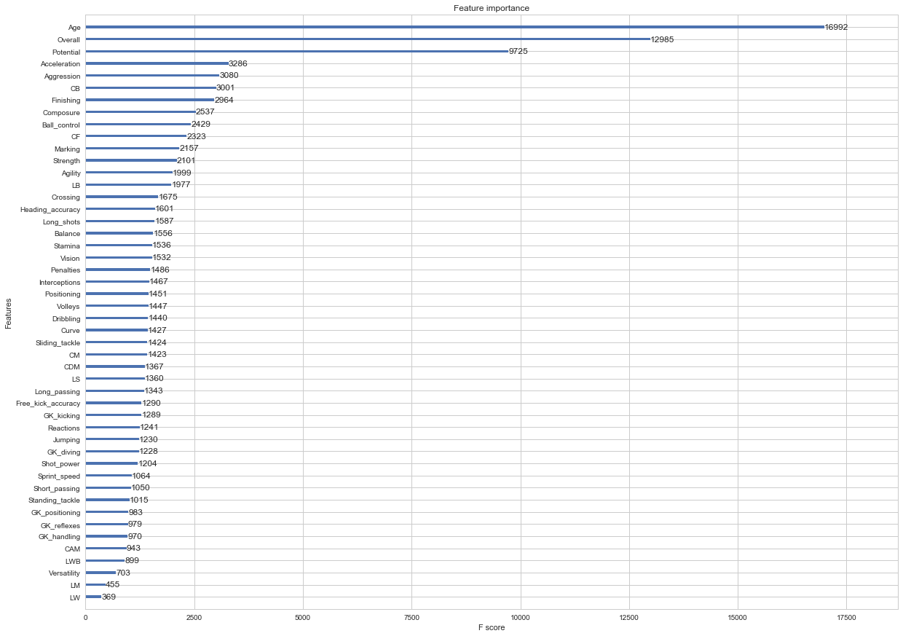


```python
#Tree Diagram
plt.figure()
plt.savefig('tree_value.png')
```


    <Figure size 432x288 with 0 Axes>


### Predictions
Now we can look at who are the players our model considers to be overpriced and underpriced.


```python
#Predict the value based on the model.
dpred_value = xgb.DMatrix(preprocessed_df, label = y_value)
y_pred = pd.Series(model_value.predict(dpred_value))
```


```python
#Top 10% players with overpriced transfer values.
sub_value = y_value.subtract(y_pred)
exp_value = processed_df.loc[sub_value.nlargest(int(len(sub_value)/1000)).index]
exp_value
```


<div>
<style scoped>
    .dataframe tbody tr th:only-of-type {
        vertical-align: middle;
    }

    .dataframe tbody tr th {
        vertical-align: top;
    }

    .dataframe thead th {
        text-align: right;
    }
</style>
<table border="1" class="dataframe">
  <thead>
    <tr style="text-align: right;">
      <th></th>
      <th>Unnamed: 0</th>
      <th>Name</th>
      <th>Age</th>
      <th>Nationality</th>
      <th>Overall</th>
      <th>Potential</th>
      <th>Club</th>
      <th>Value</th>
      <th>Wage</th>
      <th>Acceleration</th>
      <th>...</th>
      <th>RB</th>
      <th>RCB</th>
      <th>RCM</th>
      <th>RDM</th>
      <th>RF</th>
      <th>RM</th>
      <th>RS</th>
      <th>RW</th>
      <th>RWB</th>
      <th>ST</th>
    </tr>
  </thead>
  <tbody>
    <tr>
      <th>183</th>
      <td>183</td>
      <td>M. Dembélé</td>
      <td>29</td>
      <td>Belgium</td>
      <td>83</td>
      <td>83</td>
      <td>Tottenham Hotspur</td>
      <td>25000000.0</td>
      <td>115000.0</td>
      <td>75.0</td>
      <td>...</td>
      <td>76.0</td>
      <td>78.0</td>
      <td>81.0</td>
      <td>80.0</td>
      <td>79.0</td>
      <td>79.0</td>
      <td>77.0</td>
      <td>78.0</td>
      <td>77.0</td>
      <td>77.0</td>
    </tr>
    <tr>
      <th>11</th>
      <td>11</td>
      <td>K. De Bruyne</td>
      <td>26</td>
      <td>Belgium</td>
      <td>89</td>
      <td>92</td>
      <td>Manchester City</td>
      <td>83000000.0</td>
      <td>285000.0</td>
      <td>76.0</td>
      <td>...</td>
      <td>66.0</td>
      <td>57.0</td>
      <td>84.0</td>
      <td>70.0</td>
      <td>85.0</td>
      <td>85.0</td>
      <td>81.0</td>
      <td>85.0</td>
      <td>71.0</td>
      <td>81.0</td>
    </tr>
    <tr>
      <th>7</th>
      <td>7</td>
      <td>E. Hazard</td>
      <td>26</td>
      <td>Belgium</td>
      <td>90</td>
      <td>91</td>
      <td>Chelsea</td>
      <td>90500000.0</td>
      <td>295000.0</td>
      <td>93.0</td>
      <td>...</td>
      <td>59.0</td>
      <td>47.0</td>
      <td>81.0</td>
      <td>61.0</td>
      <td>87.0</td>
      <td>87.0</td>
      <td>82.0</td>
      <td>88.0</td>
      <td>64.0</td>
      <td>82.0</td>
    </tr>
    <tr>
      <th>70</th>
      <td>70</td>
      <td>R. Varane</td>
      <td>24</td>
      <td>France</td>
      <td>85</td>
      <td>92</td>
      <td>Real Madrid CF</td>
      <td>46500000.0</td>
      <td>175000.0</td>
      <td>77.0</td>
      <td>...</td>
      <td>77.0</td>
      <td>83.0</td>
      <td>69.0</td>
      <td>79.0</td>
      <td>62.0</td>
      <td>63.0</td>
      <td>62.0</td>
      <td>61.0</td>
      <td>73.0</td>
      <td>62.0</td>
    </tr>
    <tr>
      <th>0</th>
      <td>0</td>
      <td>Cristiano Ronaldo</td>
      <td>32</td>
      <td>Portugal</td>
      <td>94</td>
      <td>94</td>
      <td>Real Madrid CF</td>
      <td>95500000.0</td>
      <td>565000.0</td>
      <td>89.0</td>
      <td>...</td>
      <td>61.0</td>
      <td>53.0</td>
      <td>82.0</td>
      <td>62.0</td>
      <td>91.0</td>
      <td>89.0</td>
      <td>92.0</td>
      <td>91.0</td>
      <td>66.0</td>
      <td>92.0</td>
    </tr>
    <tr>
      <th>84</th>
      <td>84</td>
      <td>M. Pjanić</td>
      <td>27</td>
      <td>Bosnia Herzegovina</td>
      <td>85</td>
      <td>86</td>
      <td>Juventus</td>
      <td>43500000.0</td>
      <td>160000.0</td>
      <td>74.0</td>
      <td>...</td>
      <td>75.0</td>
      <td>70.0</td>
      <td>83.0</td>
      <td>78.0</td>
      <td>80.0</td>
      <td>81.0</td>
      <td>74.0</td>
      <td>80.0</td>
      <td>77.0</td>
      <td>74.0</td>
    </tr>
    <tr>
      <th>25</th>
      <td>25</td>
      <td>J. Boateng</td>
      <td>28</td>
      <td>Germany</td>
      <td>88</td>
      <td>88</td>
      <td>FC Bayern Munich</td>
      <td>48000000.0</td>
      <td>215000.0</td>
      <td>72.0</td>
      <td>...</td>
      <td>81.0</td>
      <td>85.0</td>
      <td>73.0</td>
      <td>82.0</td>
      <td>66.0</td>
      <td>69.0</td>
      <td>65.0</td>
      <td>65.0</td>
      <td>79.0</td>
      <td>65.0</td>
    </tr>
    <tr>
      <th>69</th>
      <td>69</td>
      <td>Y. Carrasco</td>
      <td>23</td>
      <td>Belgium</td>
      <td>85</td>
      <td>90</td>
      <td>Atlético Madrid</td>
      <td>51500000.0</td>
      <td>77000.0</td>
      <td>87.0</td>
      <td>...</td>
      <td>56.0</td>
      <td>45.0</td>
      <td>74.0</td>
      <td>56.0</td>
      <td>83.0</td>
      <td>83.0</td>
      <td>79.0</td>
      <td>84.0</td>
      <td>60.0</td>
      <td>79.0</td>
    </tr>
    <tr>
      <th>12</th>
      <td>12</td>
      <td>T. Courtois</td>
      <td>25</td>
      <td>Belgium</td>
      <td>89</td>
      <td>92</td>
      <td>Chelsea</td>
      <td>59000000.0</td>
      <td>190000.0</td>
      <td>46.0</td>
      <td>...</td>
      <td>NaN</td>
      <td>NaN</td>
      <td>NaN</td>
      <td>NaN</td>
      <td>NaN</td>
      <td>NaN</td>
      <td>NaN</td>
      <td>NaN</td>
      <td>NaN</td>
      <td>NaN</td>
    </tr>
    <tr>
      <th>111</th>
      <td>111</td>
      <td>Bruno</td>
      <td>33</td>
      <td>Spain</td>
      <td>84</td>
      <td>84</td>
      <td>Villarreal CF</td>
      <td>18500000.0</td>
      <td>59000.0</td>
      <td>42.0</td>
      <td>...</td>
      <td>74.0</td>
      <td>78.0</td>
      <td>82.0</td>
      <td>82.0</td>
      <td>74.0</td>
      <td>72.0</td>
      <td>71.0</td>
      <td>71.0</td>
      <td>75.0</td>
      <td>71.0</td>
    </tr>
    <tr>
      <th>75</th>
      <td>75</td>
      <td>H. Mkhitaryan</td>
      <td>28</td>
      <td>Armenia</td>
      <td>85</td>
      <td>85</td>
      <td>Manchester United</td>
      <td>39000000.0</td>
      <td>195000.0</td>
      <td>88.0</td>
      <td>...</td>
      <td>70.0</td>
      <td>62.0</td>
      <td>80.0</td>
      <td>70.0</td>
      <td>83.0</td>
      <td>83.0</td>
      <td>79.0</td>
      <td>84.0</td>
      <td>73.0</td>
      <td>79.0</td>
    </tr>
    <tr>
      <th>2</th>
      <td>2</td>
      <td>Neymar</td>
      <td>25</td>
      <td>Brazil</td>
      <td>92</td>
      <td>94</td>
      <td>Paris Saint-Germain</td>
      <td>123000000.0</td>
      <td>280000.0</td>
      <td>94.0</td>
      <td>...</td>
      <td>59.0</td>
      <td>46.0</td>
      <td>79.0</td>
      <td>59.0</td>
      <td>88.0</td>
      <td>87.0</td>
      <td>84.0</td>
      <td>89.0</td>
      <td>64.0</td>
      <td>84.0</td>
    </tr>
    <tr>
      <th>93</th>
      <td>93</td>
      <td>Marco Asensio</td>
      <td>21</td>
      <td>Spain</td>
      <td>84</td>
      <td>92</td>
      <td>Real Madrid CF</td>
      <td>46000000.0</td>
      <td>175000.0</td>
      <td>79.0</td>
      <td>...</td>
      <td>60.0</td>
      <td>50.0</td>
      <td>78.0</td>
      <td>62.0</td>
      <td>81.0</td>
      <td>81.0</td>
      <td>77.0</td>
      <td>81.0</td>
      <td>65.0</td>
      <td>77.0</td>
    </tr>
    <tr>
      <th>27</th>
      <td>27</td>
      <td>M. Hummels</td>
      <td>28</td>
      <td>Germany</td>
      <td>88</td>
      <td>88</td>
      <td>FC Bayern Munich</td>
      <td>48000000.0</td>
      <td>215000.0</td>
      <td>62.0</td>
      <td>...</td>
      <td>80.0</td>
      <td>85.0</td>
      <td>77.0</td>
      <td>83.0</td>
      <td>69.0</td>
      <td>70.0</td>
      <td>69.0</td>
      <td>68.0</td>
      <td>78.0</td>
      <td>69.0</td>
    </tr>
    <tr>
      <th>737</th>
      <td>737</td>
      <td>Bruno Peres</td>
      <td>27</td>
      <td>Brazil</td>
      <td>78</td>
      <td>78</td>
      <td>Roma</td>
      <td>11000000.0</td>
      <td>62000.0</td>
      <td>89.0</td>
      <td>...</td>
      <td>79.0</td>
      <td>73.0</td>
      <td>74.0</td>
      <td>75.0</td>
      <td>75.0</td>
      <td>77.0</td>
      <td>72.0</td>
      <td>76.0</td>
      <td>79.0</td>
      <td>72.0</td>
    </tr>
    <tr>
      <th>83</th>
      <td>83</td>
      <td>A. Di María</td>
      <td>29</td>
      <td>Argentina</td>
      <td>85</td>
      <td>85</td>
      <td>Paris Saint-Germain</td>
      <td>37500000.0</td>
      <td>145000.0</td>
      <td>86.0</td>
      <td>...</td>
      <td>66.0</td>
      <td>58.0</td>
      <td>78.0</td>
      <td>66.0</td>
      <td>82.0</td>
      <td>83.0</td>
      <td>77.0</td>
      <td>83.0</td>
      <td>70.0</td>
      <td>77.0</td>
    </tr>
    <tr>
      <th>85</th>
      <td>85</td>
      <td>C. Marchisio</td>
      <td>31</td>
      <td>Italy</td>
      <td>85</td>
      <td>85</td>
      <td>Juventus</td>
      <td>33000000.0</td>
      <td>160000.0</td>
      <td>78.0</td>
      <td>...</td>
      <td>79.0</td>
      <td>77.0</td>
      <td>83.0</td>
      <td>81.0</td>
      <td>80.0</td>
      <td>81.0</td>
      <td>76.0</td>
      <td>80.0</td>
      <td>80.0</td>
      <td>76.0</td>
    </tr>
  </tbody>
</table>
<p>17 rows × 70 columns</p>
</div>


```python
#Top 10% players with underpriced transfer values.
cheap_value = sub_value.nsmallest(int(len(sub_value)/1000))
cheap_value = processed_df.loc[cheap_value.index]
cheap_value
```


<div>
<style scoped>
    .dataframe tbody tr th:only-of-type {
        vertical-align: middle;
    }

    .dataframe tbody tr th {
        vertical-align: top;
    }

    .dataframe thead th {
        text-align: right;
    }
</style>
<table border="1" class="dataframe">
  <thead>
    <tr style="text-align: right;">
      <th></th>
      <th>Unnamed: 0</th>
      <th>Name</th>
      <th>Age</th>
      <th>Nationality</th>
      <th>Overall</th>
      <th>Potential</th>
      <th>Club</th>
      <th>Value</th>
      <th>Wage</th>
      <th>Acceleration</th>
      <th>...</th>
      <th>RB</th>
      <th>RCB</th>
      <th>RCM</th>
      <th>RDM</th>
      <th>RF</th>
      <th>RM</th>
      <th>RS</th>
      <th>RW</th>
      <th>RWB</th>
      <th>ST</th>
    </tr>
  </thead>
  <tbody>
    <tr>
      <th>18</th>
      <td>18</td>
      <td>G. Buffon</td>
      <td>39</td>
      <td>Italy</td>
      <td>89</td>
      <td>89</td>
      <td>Juventus</td>
      <td>4500000.0</td>
      <td>110000.0</td>
      <td>49.0</td>
      <td>...</td>
      <td>NaN</td>
      <td>NaN</td>
      <td>NaN</td>
      <td>NaN</td>
      <td>NaN</td>
      <td>NaN</td>
      <td>NaN</td>
      <td>NaN</td>
      <td>NaN</td>
      <td>NaN</td>
    </tr>
    <tr>
      <th>4</th>
      <td>4</td>
      <td>M. Neuer</td>
      <td>31</td>
      <td>Germany</td>
      <td>92</td>
      <td>92</td>
      <td>FC Bayern Munich</td>
      <td>61000000.0</td>
      <td>230000.0</td>
      <td>58.0</td>
      <td>...</td>
      <td>NaN</td>
      <td>NaN</td>
      <td>NaN</td>
      <td>NaN</td>
      <td>NaN</td>
      <td>NaN</td>
      <td>NaN</td>
      <td>NaN</td>
      <td>NaN</td>
      <td>NaN</td>
    </tr>
    <tr>
      <th>10</th>
      <td>10</td>
      <td>Sergio Ramos</td>
      <td>31</td>
      <td>Spain</td>
      <td>90</td>
      <td>90</td>
      <td>Real Madrid CF</td>
      <td>52000000.0</td>
      <td>310000.0</td>
      <td>75.0</td>
      <td>...</td>
      <td>84.0</td>
      <td>87.0</td>
      <td>74.0</td>
      <td>83.0</td>
      <td>70.0</td>
      <td>71.0</td>
      <td>72.0</td>
      <td>69.0</td>
      <td>81.0</td>
      <td>72.0</td>
    </tr>
    <tr>
      <th>68</th>
      <td>68</td>
      <td>P. Čech</td>
      <td>35</td>
      <td>Czech Republic</td>
      <td>86</td>
      <td>86</td>
      <td>Arsenal</td>
      <td>10500000.0</td>
      <td>92000.0</td>
      <td>40.0</td>
      <td>...</td>
      <td>NaN</td>
      <td>NaN</td>
      <td>NaN</td>
      <td>NaN</td>
      <td>NaN</td>
      <td>NaN</td>
      <td>NaN</td>
      <td>NaN</td>
      <td>NaN</td>
      <td>NaN</td>
    </tr>
    <tr>
      <th>3067</th>
      <td>3067</td>
      <td>M. Krmenčík</td>
      <td>24</td>
      <td>Czech Republic</td>
      <td>73</td>
      <td>78</td>
      <td>NaN</td>
      <td>0.0</td>
      <td>0.0</td>
      <td>73.0</td>
      <td>...</td>
      <td>47.0</td>
      <td>46.0</td>
      <td>59.0</td>
      <td>48.0</td>
      <td>70.0</td>
      <td>67.0</td>
      <td>72.0</td>
      <td>69.0</td>
      <td>49.0</td>
      <td>72.0</td>
    </tr>
    <tr>
      <th>2626</th>
      <td>2626</td>
      <td>J. Zmrhal</td>
      <td>23</td>
      <td>Czech Republic</td>
      <td>73</td>
      <td>78</td>
      <td>NaN</td>
      <td>0.0</td>
      <td>0.0</td>
      <td>80.0</td>
      <td>...</td>
      <td>63.0</td>
      <td>57.0</td>
      <td>69.0</td>
      <td>62.0</td>
      <td>71.0</td>
      <td>72.0</td>
      <td>70.0</td>
      <td>71.0</td>
      <td>65.0</td>
      <td>70.0</td>
    </tr>
    <tr>
      <th>197</th>
      <td>197</td>
      <td>Casillas</td>
      <td>36</td>
      <td>Spain</td>
      <td>83</td>
      <td>83</td>
      <td>FC Porto</td>
      <td>3500000.0</td>
      <td>10000.0</td>
      <td>59.0</td>
      <td>...</td>
      <td>NaN</td>
      <td>NaN</td>
      <td>NaN</td>
      <td>NaN</td>
      <td>NaN</td>
      <td>NaN</td>
      <td>NaN</td>
      <td>NaN</td>
      <td>NaN</td>
      <td>NaN</td>
    </tr>
    <tr>
      <th>2553</th>
      <td>2553</td>
      <td>J. Fuenzalida</td>
      <td>32</td>
      <td>Chile</td>
      <td>74</td>
      <td>74</td>
      <td>NaN</td>
      <td>0.0</td>
      <td>0.0</td>
      <td>82.0</td>
      <td>...</td>
      <td>72.0</td>
      <td>68.0</td>
      <td>72.0</td>
      <td>70.0</td>
      <td>73.0</td>
      <td>75.0</td>
      <td>70.0</td>
      <td>74.0</td>
      <td>73.0</td>
      <td>70.0</td>
    </tr>
    <tr>
      <th>33</th>
      <td>33</td>
      <td>N. Kanté</td>
      <td>26</td>
      <td>France</td>
      <td>87</td>
      <td>90</td>
      <td>Chelsea</td>
      <td>52500000.0</td>
      <td>190000.0</td>
      <td>82.0</td>
      <td>...</td>
      <td>82.0</td>
      <td>81.0</td>
      <td>81.0</td>
      <td>84.0</td>
      <td>76.0</td>
      <td>78.0</td>
      <td>72.0</td>
      <td>76.0</td>
      <td>83.0</td>
      <td>72.0</td>
    </tr>
    <tr>
      <th>2912</th>
      <td>2912</td>
      <td>J. Góralski</td>
      <td>24</td>
      <td>Poland</td>
      <td>73</td>
      <td>77</td>
      <td>NaN</td>
      <td>0.0</td>
      <td>0.0</td>
      <td>70.0</td>
      <td>...</td>
      <td>70.0</td>
      <td>70.0</td>
      <td>68.0</td>
      <td>72.0</td>
      <td>61.0</td>
      <td>65.0</td>
      <td>58.0</td>
      <td>62.0</td>
      <td>70.0</td>
      <td>58.0</td>
    </tr>
    <tr>
      <th>3938</th>
      <td>3938</td>
      <td>M. Siopis</td>
      <td>23</td>
      <td>Greece</td>
      <td>72</td>
      <td>77</td>
      <td>NaN</td>
      <td>0.0</td>
      <td>0.0</td>
      <td>72.0</td>
      <td>...</td>
      <td>71.0</td>
      <td>70.0</td>
      <td>66.0</td>
      <td>71.0</td>
      <td>62.0</td>
      <td>64.0</td>
      <td>59.0</td>
      <td>63.0</td>
      <td>71.0</td>
      <td>59.0</td>
    </tr>
    <tr>
      <th>3753</th>
      <td>3753</td>
      <td>J. Hušbauer</td>
      <td>27</td>
      <td>Czech Republic</td>
      <td>72</td>
      <td>73</td>
      <td>NaN</td>
      <td>0.0</td>
      <td>0.0</td>
      <td>66.0</td>
      <td>...</td>
      <td>67.0</td>
      <td>62.0</td>
      <td>71.0</td>
      <td>68.0</td>
      <td>68.0</td>
      <td>69.0</td>
      <td>64.0</td>
      <td>68.0</td>
      <td>69.0</td>
      <td>64.0</td>
    </tr>
    <tr>
      <th>63</th>
      <td>63</td>
      <td>Miranda</td>
      <td>32</td>
      <td>Brazil</td>
      <td>86</td>
      <td>86</td>
      <td>Inter</td>
      <td>25500000.0</td>
      <td>115000.0</td>
      <td>67.0</td>
      <td>...</td>
      <td>77.0</td>
      <td>84.0</td>
      <td>67.0</td>
      <td>79.0</td>
      <td>62.0</td>
      <td>63.0</td>
      <td>63.0</td>
      <td>61.0</td>
      <td>75.0</td>
      <td>63.0</td>
    </tr>
    <tr>
      <th>4058</th>
      <td>4058</td>
      <td>S. Filip</td>
      <td>23</td>
      <td>Romania</td>
      <td>71</td>
      <td>78</td>
      <td>NaN</td>
      <td>0.0</td>
      <td>0.0</td>
      <td>76.0</td>
      <td>...</td>
      <td>70.0</td>
      <td>71.0</td>
      <td>62.0</td>
      <td>69.0</td>
      <td>60.0</td>
      <td>62.0</td>
      <td>61.0</td>
      <td>61.0</td>
      <td>69.0</td>
      <td>61.0</td>
    </tr>
    <tr>
      <th>1549</th>
      <td>1549</td>
      <td>E. Paredes</td>
      <td>36</td>
      <td>Chile</td>
      <td>76</td>
      <td>76</td>
      <td>NaN</td>
      <td>0.0</td>
      <td>0.0</td>
      <td>69.0</td>
      <td>...</td>
      <td>51.0</td>
      <td>47.0</td>
      <td>68.0</td>
      <td>53.0</td>
      <td>74.0</td>
      <td>72.0</td>
      <td>75.0</td>
      <td>72.0</td>
      <td>54.0</td>
      <td>75.0</td>
    </tr>
    <tr>
      <th>653</th>
      <td>653</td>
      <td>V. Moses</td>
      <td>26</td>
      <td>Nigeria</td>
      <td>79</td>
      <td>81</td>
      <td>Chelsea</td>
      <td>12500000.0</td>
      <td>115000.0</td>
      <td>84.0</td>
      <td>...</td>
      <td>75.0</td>
      <td>70.0</td>
      <td>75.0</td>
      <td>72.0</td>
      <td>77.0</td>
      <td>78.0</td>
      <td>75.0</td>
      <td>77.0</td>
      <td>76.0</td>
      <td>75.0</td>
    </tr>
    <tr>
      <th>13</th>
      <td>13</td>
      <td>A. Sánchez</td>
      <td>28</td>
      <td>Chile</td>
      <td>89</td>
      <td>89</td>
      <td>Arsenal</td>
      <td>67500000.0</td>
      <td>265000.0</td>
      <td>88.0</td>
      <td>...</td>
      <td>62.0</td>
      <td>56.0</td>
      <td>79.0</td>
      <td>64.0</td>
      <td>85.0</td>
      <td>85.0</td>
      <td>83.0</td>
      <td>86.0</td>
      <td>66.0</td>
      <td>83.0</td>
    </tr>
  </tbody>
</table>
<p>17 rows × 70 columns</p>
</div>


```python
model_value.save_model("model_value.model")
```

## Wage


```python
dtrain_wage = xgb.DMatrix(X_train_wage, label=y_train_wage)
dtest_wage = xgb.DMatrix(X_test_wage, label=y_test_wage)
evaluation_set_wage = [(dtest_wage, "Test_set")]
```

### Create Baseline Model for Comparison (Average)


```python
mean_train_wage = np.mean(y_train_wage)

# Get predictions on the test set
baseline_predictions_wage = np.ones(y_test_wage.shape) * mean_train_wage

# Compute MAE
mae_baseline_wage = mean_absolute_error(y_test_wage, baseline_predictions_wage)

# Compute RMSE
rmse_baseline_wage = sqrt(mean_squared_error(y_test_wage, baseline_predictions_wage))

print("Baseline MAE is {:.2f}".format(mae_baseline_wage))
print("Baseline RMSE is {:.2f}".format(rmse_baseline_wage))
```

    Baseline MAE is 11871.84
    Baseline RMSE is 21765.56


### Grid Search for Best Parameters


```python
best_score_wage = mae_baseline_wage
best_params_wage = {}
for i, grid_search_wage in enumerate(params_perms):
    print("Permutation number:", i+1)
    cv_results_wage = xgb.cv(grid_search_wage,
                        dtrain_wage,
                        num_boost_round=num_boost_round,
                        seed=42,
                        nfold=2,
                        metrics=['mae', 'rmse'],
                        early_stopping_rounds=early_stopping_rounds
                        )
    
    mean_mae_wage = cv_results_wage['test-mae-mean'].min()
    boost_rounds_wage = cv_results_wage['test-mae-mean'].argmin()
    print("\tMAE {} for {} rounds".format(mean_mae_wage, boost_rounds_wage))
    if mean_mae_wage < best_score_wage:
        best_score_wage = mean_mae_wage
        best_params_wage = grid_search_wage
```

    Permutation number: 1


    /Users/paulfournier/anaconda3/lib/python3.6/site-packages/ipykernel_launcher.py:15: FutureWarning:
    
    'argmin' is deprecated, use 'idxmin' instead. The behavior of 'argmin'
    will be corrected to return the positional minimum in the future.
    Use 'series.values.argmin' to get the position of the minimum now.
    


    	MAE 5440.9719239999995 for 225 rounds
    Permutation number: 2
    	MAE 5427.44751 for 234 rounds
    Permutation number: 3
    	MAE 5439.9589845 for 223 rounds
    Permutation number: 4
    	MAE 5427.2687989999995 for 220 rounds
    Permutation number: 5
    	MAE 5474.142334 for 230 rounds
    Permutation number: 6
    	MAE 5472.523681500001 for 224 rounds
    Permutation number: 7
    	MAE 5456.0693360000005 for 217 rounds
    Permutation number: 8
    	MAE 5532.402832 for 228 rounds
    Permutation number: 9
    	MAE 5440.9719239999995 for 225 rounds
    Permutation number: 10
    	MAE 5427.44751 for 234 rounds
    Permutation number: 11
    	MAE 5439.9589845 for 223 rounds
    Permutation number: 12
    	MAE 5427.2687989999995 for 220 rounds
    Permutation number: 13
    	MAE 5474.142334 for 230 rounds
    Permutation number: 14
    	MAE 5472.523681500001 for 224 rounds
    Permutation number: 15
    	MAE 5456.0693360000005 for 217 rounds
    Permutation number: 16
    	MAE 5532.402832 for 228 rounds
    Permutation number: 17
    	MAE 5479.5983885000005 for 21 rounds
    Permutation number: 18
    	MAE 5514.756592 for 22 rounds
    Permutation number: 19
    	MAE 5496.497803 for 21 rounds
    Permutation number: 20
    	MAE 5504.813477 for 23 rounds
    Permutation number: 21
    	MAE 5493.222168 for 22 rounds
    Permutation number: 22
    	MAE 5479.5061035 for 21 rounds
    Permutation number: 23
    	MAE 5484.438964999999 for 20 rounds
    Permutation number: 24
    	MAE 5533.9353025 for 20 rounds
    Permutation number: 25
    	MAE 5479.5983885000005 for 21 rounds
    Permutation number: 26
    	MAE 5514.756592 for 22 rounds
    Permutation number: 27
    	MAE 5496.497803 for 21 rounds
    Permutation number: 28
    	MAE 5504.813477 for 23 rounds
    Permutation number: 29
    	MAE 5493.222168 for 22 rounds
    Permutation number: 30
    	MAE 5479.5061035 for 21 rounds
    Permutation number: 31
    	MAE 5484.438964999999 for 20 rounds
    Permutation number: 32
    	MAE 5533.9353025 for 20 rounds


### Retrain the Model with the Best Parameters


```python
#Retrain a model with new best params
model_wage = xgb.train(
    best_params_wage,
    dtrain_wage,
    num_boost_round=num_boost_round,
    evals=evaluation_set_wage,
    early_stopping_rounds=early_stopping_rounds
)
```

    [0]	Test_set-rmse:24422.4	Test_set-mae:11357.4
    Multiple eval metrics have been passed: 'Test_set-mae' will be used for early stopping.
    
    Will train until Test_set-mae hasn't improved in 10 rounds.
    [1]	Test_set-rmse:24246.4	Test_set-mae:11253.2
    [2]	Test_set-rmse:24069.8	Test_set-mae:11151.4
    [3]	Test_set-rmse:23888.8	Test_set-mae:11048.3
    [4]	Test_set-rmse:23706.7	Test_set-mae:10947.7
    [5]	Test_set-rmse:23526.4	Test_set-mae:10848
    [6]	Test_set-rmse:23357.9	Test_set-mae:10750.6
    [7]	Test_set-rmse:23201.9	Test_set-mae:10655.5
    [8]	Test_set-rmse:23036.9	Test_set-mae:10560.7
    [9]	Test_set-rmse:22871.7	Test_set-mae:10467.2
    [10]	Test_set-rmse:22705.1	Test_set-mae:10372.5
    [11]	Test_set-rmse:22556.1	Test_set-mae:10282.8
    [12]	Test_set-rmse:22403.9	Test_set-mae:10192.7
    [13]	Test_set-rmse:22240.6	Test_set-mae:10101.3
    [14]	Test_set-rmse:22090	Test_set-mae:10013.1
    [15]	Test_set-rmse:21935.4	Test_set-mae:9925.54
    [16]	Test_set-rmse:21776.8	Test_set-mae:9837.8
    [17]	Test_set-rmse:21636.7	Test_set-mae:9752.91
    [18]	Test_set-rmse:21487.1	Test_set-mae:9670.64
    [19]	Test_set-rmse:21339.5	Test_set-mae:9585.03
    [20]	Test_set-rmse:21201.3	Test_set-mae:9504.82
    [21]	Test_set-rmse:21065.9	Test_set-mae:9424.2
    [22]	Test_set-rmse:20924	Test_set-mae:9342.7
    [23]	Test_set-rmse:20795.7	Test_set-mae:9263.06
    [24]	Test_set-rmse:20660.8	Test_set-mae:9184.66
    [25]	Test_set-rmse:20518.8	Test_set-mae:9107.71
    [26]	Test_set-rmse:20387.6	Test_set-mae:9031.7
    [27]	Test_set-rmse:20257.9	Test_set-mae:8954.81
    [28]	Test_set-rmse:20131.1	Test_set-mae:8881.07
    [29]	Test_set-rmse:19998.6	Test_set-mae:8807.13
    [30]	Test_set-rmse:19879	Test_set-mae:8735.61
    [31]	Test_set-rmse:19748.2	Test_set-mae:8664.42
    [32]	Test_set-rmse:19629.4	Test_set-mae:8594.91
    [33]	Test_set-rmse:19505.5	Test_set-mae:8525.78
    [34]	Test_set-rmse:19393.5	Test_set-mae:8460.08
    [35]	Test_set-rmse:19280.2	Test_set-mae:8395.59
    [36]	Test_set-rmse:19163.4	Test_set-mae:8330.81
    [37]	Test_set-rmse:19047.7	Test_set-mae:8268.25
    [38]	Test_set-rmse:18935	Test_set-mae:8207.15
    [39]	Test_set-rmse:18825.9	Test_set-mae:8147.54
    [40]	Test_set-rmse:18719.8	Test_set-mae:8086.92
    [41]	Test_set-rmse:18604.5	Test_set-mae:8025.52
    [42]	Test_set-rmse:18501.9	Test_set-mae:7968.01
    [43]	Test_set-rmse:18391.2	Test_set-mae:7909.23
    [44]	Test_set-rmse:18288.5	Test_set-mae:7852.44
    [45]	Test_set-rmse:18183.3	Test_set-mae:7796.14
    [46]	Test_set-rmse:18080.1	Test_set-mae:7742.22
    [47]	Test_set-rmse:17979.3	Test_set-mae:7690.63
    [48]	Test_set-rmse:17893.1	Test_set-mae:7641.35
    [49]	Test_set-rmse:17794.4	Test_set-mae:7591.03
    [50]	Test_set-rmse:17698.1	Test_set-mae:7542.6
    [51]	Test_set-rmse:17602.5	Test_set-mae:7492.92
    [52]	Test_set-rmse:17503.9	Test_set-mae:7443.56
    [53]	Test_set-rmse:17414.3	Test_set-mae:7396.56
    [54]	Test_set-rmse:17321.6	Test_set-mae:7351.87
    [55]	Test_set-rmse:17236.5	Test_set-mae:7307.08
    [56]	Test_set-rmse:17137	Test_set-mae:7260.7
    [57]	Test_set-rmse:17057.5	Test_set-mae:7218.07
    [58]	Test_set-rmse:16963.4	Test_set-mae:7174.46
    [59]	Test_set-rmse:16878.6	Test_set-mae:7132.83
    [60]	Test_set-rmse:16791.1	Test_set-mae:7093.25
    [61]	Test_set-rmse:16703.1	Test_set-mae:7054.25
    [62]	Test_set-rmse:16613.2	Test_set-mae:7014.59
    [63]	Test_set-rmse:16537.8	Test_set-mae:6978.25
    [64]	Test_set-rmse:16458.6	Test_set-mae:6944.22
    [65]	Test_set-rmse:16379.2	Test_set-mae:6908.45
    [66]	Test_set-rmse:16295	Test_set-mae:6873.35
    [67]	Test_set-rmse:16219.1	Test_set-mae:6840.17
    [68]	Test_set-rmse:16142.6	Test_set-mae:6807.96
    [69]	Test_set-rmse:16069.3	Test_set-mae:6776.92
    [70]	Test_set-rmse:15988.7	Test_set-mae:6743.87
    [71]	Test_set-rmse:15907.6	Test_set-mae:6711.42
    [72]	Test_set-rmse:15830.1	Test_set-mae:6679.25
    [73]	Test_set-rmse:15763.5	Test_set-mae:6647.98
    [74]	Test_set-rmse:15700.7	Test_set-mae:6619.18
    [75]	Test_set-rmse:15629.1	Test_set-mae:6591.51
    [76]	Test_set-rmse:15563.6	Test_set-mae:6563.46
    [77]	Test_set-rmse:15494.4	Test_set-mae:6534.48
    [78]	Test_set-rmse:15425.7	Test_set-mae:6506.7
    [79]	Test_set-rmse:15363.5	Test_set-mae:6479.96
    [80]	Test_set-rmse:15294.3	Test_set-mae:6453.02
    [81]	Test_set-rmse:15230	Test_set-mae:6426.17
    [82]	Test_set-rmse:15163.5	Test_set-mae:6400.42
    [83]	Test_set-rmse:15104.5	Test_set-mae:6377.03
    [84]	Test_set-rmse:15040.5	Test_set-mae:6352.49
    [85]	Test_set-rmse:14981.6	Test_set-mae:6329.57
    [86]	Test_set-rmse:14922	Test_set-mae:6305.47
    [87]	Test_set-rmse:14857.5	Test_set-mae:6282.36
    [88]	Test_set-rmse:14798	Test_set-mae:6259.41
    [89]	Test_set-rmse:14746.4	Test_set-mae:6238.36
    [90]	Test_set-rmse:14696.6	Test_set-mae:6216.46
    [91]	Test_set-rmse:14640	Test_set-mae:6195.98
    [92]	Test_set-rmse:14587.2	Test_set-mae:6175.88
    [93]	Test_set-rmse:14528.9	Test_set-mae:6154.96
    [94]	Test_set-rmse:14475.4	Test_set-mae:6135.1
    [95]	Test_set-rmse:14419.1	Test_set-mae:6115.24
    [96]	Test_set-rmse:14370	Test_set-mae:6096.33
    [97]	Test_set-rmse:14318	Test_set-mae:6077.55
    [98]	Test_set-rmse:14264	Test_set-mae:6058.07
    [99]	Test_set-rmse:14215	Test_set-mae:6039.08
    [100]	Test_set-rmse:14168.6	Test_set-mae:6020.57
    [101]	Test_set-rmse:14121.8	Test_set-mae:6002.82
    [102]	Test_set-rmse:14075.3	Test_set-mae:5986.77
    [103]	Test_set-rmse:14031.9	Test_set-mae:5970.03
    [104]	Test_set-rmse:13987	Test_set-mae:5953.33
    [105]	Test_set-rmse:13940.2	Test_set-mae:5936.98
    [106]	Test_set-rmse:13896.7	Test_set-mae:5921.42
    [107]	Test_set-rmse:13846.6	Test_set-mae:5905.68
    [108]	Test_set-rmse:13800	Test_set-mae:5890.6
    [109]	Test_set-rmse:13755.1	Test_set-mae:5876.27
    [110]	Test_set-rmse:13709.8	Test_set-mae:5860.02
    [111]	Test_set-rmse:13673.7	Test_set-mae:5847.04
    [112]	Test_set-rmse:13640.9	Test_set-mae:5834.97
    [113]	Test_set-rmse:13599.5	Test_set-mae:5821.92
    [114]	Test_set-rmse:13558.7	Test_set-mae:5808.55
    [115]	Test_set-rmse:13525	Test_set-mae:5796.7
    [116]	Test_set-rmse:13488.9	Test_set-mae:5785.57
    [117]	Test_set-rmse:13455.1	Test_set-mae:5774.2
    [118]	Test_set-rmse:13410.7	Test_set-mae:5759.93
    [119]	Test_set-rmse:13368.5	Test_set-mae:5748.54
    [120]	Test_set-rmse:13336.6	Test_set-mae:5738.04
    [121]	Test_set-rmse:13301.6	Test_set-mae:5726.68
    [122]	Test_set-rmse:13265.6	Test_set-mae:5716.42
    [123]	Test_set-rmse:13227.4	Test_set-mae:5706
    [124]	Test_set-rmse:13188.7	Test_set-mae:5695.91
    [125]	Test_set-rmse:13152.6	Test_set-mae:5685.82
    [126]	Test_set-rmse:13118.3	Test_set-mae:5676.7
    [127]	Test_set-rmse:13084.6	Test_set-mae:5667.12
    [128]	Test_set-rmse:13054.7	Test_set-mae:5658.46
    [129]	Test_set-rmse:13020	Test_set-mae:5648.74
    [130]	Test_set-rmse:12986.1	Test_set-mae:5639.05
    [131]	Test_set-rmse:12956.1	Test_set-mae:5631.14
    [132]	Test_set-rmse:12926.2	Test_set-mae:5623.15
    [133]	Test_set-rmse:12901.8	Test_set-mae:5616.18
    [134]	Test_set-rmse:12870.1	Test_set-mae:5608.38
    [135]	Test_set-rmse:12839.9	Test_set-mae:5600.23
    [136]	Test_set-rmse:12812.1	Test_set-mae:5592.85
    [137]	Test_set-rmse:12782	Test_set-mae:5585.16
    [138]	Test_set-rmse:12751	Test_set-mae:5578.36
    [139]	Test_set-rmse:12721.5	Test_set-mae:5571.95
    [140]	Test_set-rmse:12693.8	Test_set-mae:5565
    [141]	Test_set-rmse:12667	Test_set-mae:5558.13
    [142]	Test_set-rmse:12641.2	Test_set-mae:5550.83
    [143]	Test_set-rmse:12611.2	Test_set-mae:5543.64
    [144]	Test_set-rmse:12587.1	Test_set-mae:5538.17
    [145]	Test_set-rmse:12560.4	Test_set-mae:5531.4
    [146]	Test_set-rmse:12547.5	Test_set-mae:5527.42
    [147]	Test_set-rmse:12522.9	Test_set-mae:5521.63
    [148]	Test_set-rmse:12499.6	Test_set-mae:5515.98
    [149]	Test_set-rmse:12476.9	Test_set-mae:5510.71
    [150]	Test_set-rmse:12456.6	Test_set-mae:5505.26
    [151]	Test_set-rmse:12436.5	Test_set-mae:5500.71
    [152]	Test_set-rmse:12413.1	Test_set-mae:5495.93
    [153]	Test_set-rmse:12394.4	Test_set-mae:5491.73
    [154]	Test_set-rmse:12373.2	Test_set-mae:5486.16
    [155]	Test_set-rmse:12357.1	Test_set-mae:5482.4
    [156]	Test_set-rmse:12332.7	Test_set-mae:5477.62
    [157]	Test_set-rmse:12313.9	Test_set-mae:5473.67
    [158]	Test_set-rmse:12290.5	Test_set-mae:5469.1
    [159]	Test_set-rmse:12267.7	Test_set-mae:5465.41
    [160]	Test_set-rmse:12248.3	Test_set-mae:5461.39
    [161]	Test_set-rmse:12228.5	Test_set-mae:5456.65
    [162]	Test_set-rmse:12210.4	Test_set-mae:5453.33
    [163]	Test_set-rmse:12189.6	Test_set-mae:5449.53
    [164]	Test_set-rmse:12172.9	Test_set-mae:5447.15
    [165]	Test_set-rmse:12156.8	Test_set-mae:5444.6
    [166]	Test_set-rmse:12141	Test_set-mae:5441.45
    [167]	Test_set-rmse:12122.5	Test_set-mae:5437.75
    [168]	Test_set-rmse:12105.1	Test_set-mae:5434.57
    [169]	Test_set-rmse:12092.4	Test_set-mae:5431.96
    [170]	Test_set-rmse:12075.1	Test_set-mae:5428.73
    [171]	Test_set-rmse:12060.3	Test_set-mae:5426.1
    [172]	Test_set-rmse:12045.4	Test_set-mae:5423.38
    [173]	Test_set-rmse:12027.6	Test_set-mae:5420.04
    [174]	Test_set-rmse:12015	Test_set-mae:5417.03
    [175]	Test_set-rmse:12001.1	Test_set-mae:5414.86
    [176]	Test_set-rmse:11981.9	Test_set-mae:5411.14
    [177]	Test_set-rmse:11971.2	Test_set-mae:5409.07
    [178]	Test_set-rmse:11954.5	Test_set-mae:5406.88
    [179]	Test_set-rmse:11939.5	Test_set-mae:5404.89
    [180]	Test_set-rmse:11925.5	Test_set-mae:5403.55
    [181]	Test_set-rmse:11915.5	Test_set-mae:5401.29
    [182]	Test_set-rmse:11902.9	Test_set-mae:5398.98
    [183]	Test_set-rmse:11890	Test_set-mae:5396.54
    [184]	Test_set-rmse:11877	Test_set-mae:5394.61
    [185]	Test_set-rmse:11861.8	Test_set-mae:5392.21
    [186]	Test_set-rmse:11848.3	Test_set-mae:5388.85
    [187]	Test_set-rmse:11833.2	Test_set-mae:5386.29
    [188]	Test_set-rmse:11821.1	Test_set-mae:5384.57
    [189]	Test_set-rmse:11806.4	Test_set-mae:5381.8
    [190]	Test_set-rmse:11791.9	Test_set-mae:5379.68
    [191]	Test_set-rmse:11784	Test_set-mae:5378.1
    [192]	Test_set-rmse:11770	Test_set-mae:5375.52
    [193]	Test_set-rmse:11760.4	Test_set-mae:5374.18
    [194]	Test_set-rmse:11746.9	Test_set-mae:5372.19
    [195]	Test_set-rmse:11735.7	Test_set-mae:5369.8
    [196]	Test_set-rmse:11729.2	Test_set-mae:5369.92
    [197]	Test_set-rmse:11718.8	Test_set-mae:5368.62
    [198]	Test_set-rmse:11707.5	Test_set-mae:5368.2
    [199]	Test_set-rmse:11696.3	Test_set-mae:5366.42
    [200]	Test_set-rmse:11685.7	Test_set-mae:5365.33
    [201]	Test_set-rmse:11676.3	Test_set-mae:5364.21
    [202]	Test_set-rmse:11668.9	Test_set-mae:5363.71
    [203]	Test_set-rmse:11659.7	Test_set-mae:5363.1
    [204]	Test_set-rmse:11651.5	Test_set-mae:5361.85
    [205]	Test_set-rmse:11643.7	Test_set-mae:5361.14
    [206]	Test_set-rmse:11635.2	Test_set-mae:5360.55
    [207]	Test_set-rmse:11626.4	Test_set-mae:5360.6
    [208]	Test_set-rmse:11613.3	Test_set-mae:5358.99
    [209]	Test_set-rmse:11603.5	Test_set-mae:5358.26
    [210]	Test_set-rmse:11592.5	Test_set-mae:5356.93
    [211]	Test_set-rmse:11587.9	Test_set-mae:5356.93
    [212]	Test_set-rmse:11577.3	Test_set-mae:5356.45
    [213]	Test_set-rmse:11567.2	Test_set-mae:5355.57
    [214]	Test_set-rmse:11557.9	Test_set-mae:5355.03
    [215]	Test_set-rmse:11546.2	Test_set-mae:5353.89
    [216]	Test_set-rmse:11537.2	Test_set-mae:5353.24
    [217]	Test_set-rmse:11529.7	Test_set-mae:5352.44
    [218]	Test_set-rmse:11524	Test_set-mae:5351.89
    [219]	Test_set-rmse:11517.9	Test_set-mae:5351.4
    [220]	Test_set-rmse:11510.9	Test_set-mae:5351.16
    [221]	Test_set-rmse:11505	Test_set-mae:5351.41
    [222]	Test_set-rmse:11500.8	Test_set-mae:5351.44
    [223]	Test_set-rmse:11495.6	Test_set-mae:5350.87
    [224]	Test_set-rmse:11487.5	Test_set-mae:5349.97
    [225]	Test_set-rmse:11482.2	Test_set-mae:5349.91
    [226]	Test_set-rmse:11474.1	Test_set-mae:5349.32
    [227]	Test_set-rmse:11466.4	Test_set-mae:5349.02
    [228]	Test_set-rmse:11461.8	Test_set-mae:5349.16
    [229]	Test_set-rmse:11454.6	Test_set-mae:5349.27
    [230]	Test_set-rmse:11446.5	Test_set-mae:5348.64
    [231]	Test_set-rmse:11440.7	Test_set-mae:5348.57
    [232]	Test_set-rmse:11432.8	Test_set-mae:5348.56
    [233]	Test_set-rmse:11426.2	Test_set-mae:5348.53
    [234]	Test_set-rmse:11419.3	Test_set-mae:5347.97
    [235]	Test_set-rmse:11414.2	Test_set-mae:5348.28
    [236]	Test_set-rmse:11407.7	Test_set-mae:5348.06
    [237]	Test_set-rmse:11400.4	Test_set-mae:5347.77
    [238]	Test_set-rmse:11395.1	Test_set-mae:5347.7
    [239]	Test_set-rmse:11389.9	Test_set-mae:5347.07
    [240]	Test_set-rmse:11383	Test_set-mae:5346.71
    [241]	Test_set-rmse:11377.1	Test_set-mae:5346.69
    [242]	Test_set-rmse:11372.9	Test_set-mae:5346.93
    [243]	Test_set-rmse:11365.5	Test_set-mae:5346.54
    [244]	Test_set-rmse:11355.2	Test_set-mae:5346.18
    [245]	Test_set-rmse:11347.8	Test_set-mae:5345.55
    [246]	Test_set-rmse:11341.4	Test_set-mae:5345.35
    [247]	Test_set-rmse:11337.2	Test_set-mae:5345.63
    [248]	Test_set-rmse:11333.9	Test_set-mae:5345.97
    [249]	Test_set-rmse:11329.7	Test_set-mae:5345.65
    [250]	Test_set-rmse:11324.4	Test_set-mae:5345.96
    [251]	Test_set-rmse:11318.6	Test_set-mae:5345.63
    [252]	Test_set-rmse:11314.3	Test_set-mae:5345.83
    [253]	Test_set-rmse:11310.7	Test_set-mae:5346.44
    [254]	Test_set-rmse:11307.8	Test_set-mae:5346.8
    [255]	Test_set-rmse:11302.5	Test_set-mae:5346.47
    [256]	Test_set-rmse:11298	Test_set-mae:5347.05
    Stopping. Best iteration:
    [246]	Test_set-rmse:11341.4	Test_set-mae:5345.35
    


### Evaluate the Model


```python
print("Average guess error", mae_baseline_wage)
print("vs Mean Absolute Error", mean_absolute_error(model_wage.predict(dtest_wage), y_test_wage))
```

    Average guess error 11871.840541632919
    vs Mean Absolute Error 5347.052965959046


### Model Summary


```python
#Feature Importance
plt.figure(figsize=(20,15))
xgb.plot_importance(model_wage, ax=plt.gca())
```


    <matplotlib.axes._subplots.AxesSubplot at 0x1a1d9f7c50>


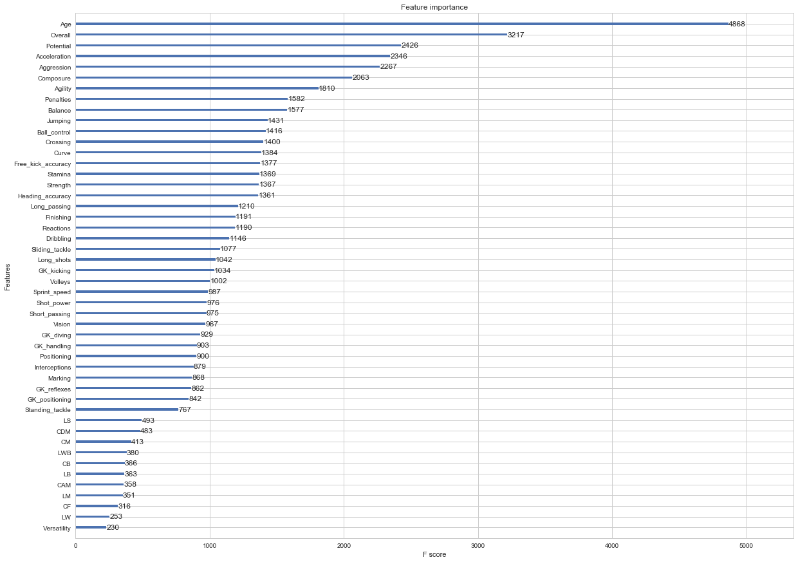


### Predictions


```python
#Predict the value based on the model.
dpred_wage = xgb.DMatrix(preprocessed_df, label = y_wage)
y_pred_wage = pd.Series(model_wage.predict(dpred_wage))
```


```python
#Top 10% players with overpriced wages.
sub_wage = y_value.subtract(y_pred_wage)
exp_wage = processed_df.loc[sub_wage.nlargest(int(len(sub_wage)/1000)).index]
exp_wage
```


<div>
<style scoped>
    .dataframe tbody tr th:only-of-type {
        vertical-align: middle;
    }

    .dataframe tbody tr th {
        vertical-align: top;
    }

    .dataframe thead th {
        text-align: right;
    }
</style>
<table border="1" class="dataframe">
  <thead>
    <tr style="text-align: right;">
      <th></th>
      <th>Unnamed: 0</th>
      <th>Name</th>
      <th>Age</th>
      <th>Nationality</th>
      <th>Overall</th>
      <th>Potential</th>
      <th>Club</th>
      <th>Value</th>
      <th>Wage</th>
      <th>Acceleration</th>
      <th>...</th>
      <th>RB</th>
      <th>RCB</th>
      <th>RCM</th>
      <th>RDM</th>
      <th>RF</th>
      <th>RM</th>
      <th>RS</th>
      <th>RW</th>
      <th>RWB</th>
      <th>ST</th>
    </tr>
  </thead>
  <tbody>
    <tr>
      <th>2</th>
      <td>2</td>
      <td>Neymar</td>
      <td>25</td>
      <td>Brazil</td>
      <td>92</td>
      <td>94</td>
      <td>Paris Saint-Germain</td>
      <td>123000000.0</td>
      <td>280000.0</td>
      <td>94.0</td>
      <td>...</td>
      <td>59.0</td>
      <td>46.0</td>
      <td>79.0</td>
      <td>59.0</td>
      <td>88.0</td>
      <td>87.0</td>
      <td>84.0</td>
      <td>89.0</td>
      <td>64.0</td>
      <td>84.0</td>
    </tr>
    <tr>
      <th>1</th>
      <td>1</td>
      <td>L. Messi</td>
      <td>30</td>
      <td>Argentina</td>
      <td>93</td>
      <td>93</td>
      <td>FC Barcelona</td>
      <td>105000000.0</td>
      <td>565000.0</td>
      <td>92.0</td>
      <td>...</td>
      <td>57.0</td>
      <td>45.0</td>
      <td>84.0</td>
      <td>59.0</td>
      <td>92.0</td>
      <td>90.0</td>
      <td>88.0</td>
      <td>91.0</td>
      <td>62.0</td>
      <td>88.0</td>
    </tr>
    <tr>
      <th>3</th>
      <td>3</td>
      <td>L. Suárez</td>
      <td>30</td>
      <td>Uruguay</td>
      <td>92</td>
      <td>92</td>
      <td>FC Barcelona</td>
      <td>97000000.0</td>
      <td>510000.0</td>
      <td>88.0</td>
      <td>...</td>
      <td>64.0</td>
      <td>58.0</td>
      <td>80.0</td>
      <td>65.0</td>
      <td>88.0</td>
      <td>85.0</td>
      <td>88.0</td>
      <td>87.0</td>
      <td>68.0</td>
      <td>88.0</td>
    </tr>
    <tr>
      <th>0</th>
      <td>0</td>
      <td>Cristiano Ronaldo</td>
      <td>32</td>
      <td>Portugal</td>
      <td>94</td>
      <td>94</td>
      <td>Real Madrid CF</td>
      <td>95500000.0</td>
      <td>565000.0</td>
      <td>89.0</td>
      <td>...</td>
      <td>61.0</td>
      <td>53.0</td>
      <td>82.0</td>
      <td>62.0</td>
      <td>91.0</td>
      <td>89.0</td>
      <td>92.0</td>
      <td>91.0</td>
      <td>66.0</td>
      <td>92.0</td>
    </tr>
    <tr>
      <th>5</th>
      <td>5</td>
      <td>R. Lewandowski</td>
      <td>28</td>
      <td>Poland</td>
      <td>91</td>
      <td>91</td>
      <td>FC Bayern Munich</td>
      <td>92000000.0</td>
      <td>355000.0</td>
      <td>79.0</td>
      <td>...</td>
      <td>58.0</td>
      <td>57.0</td>
      <td>78.0</td>
      <td>62.0</td>
      <td>87.0</td>
      <td>82.0</td>
      <td>88.0</td>
      <td>84.0</td>
      <td>61.0</td>
      <td>88.0</td>
    </tr>
    <tr>
      <th>7</th>
      <td>7</td>
      <td>E. Hazard</td>
      <td>26</td>
      <td>Belgium</td>
      <td>90</td>
      <td>91</td>
      <td>Chelsea</td>
      <td>90500000.0</td>
      <td>295000.0</td>
      <td>93.0</td>
      <td>...</td>
      <td>59.0</td>
      <td>47.0</td>
      <td>81.0</td>
      <td>61.0</td>
      <td>87.0</td>
      <td>87.0</td>
      <td>82.0</td>
      <td>88.0</td>
      <td>64.0</td>
      <td>82.0</td>
    </tr>
    <tr>
      <th>11</th>
      <td>11</td>
      <td>K. De Bruyne</td>
      <td>26</td>
      <td>Belgium</td>
      <td>89</td>
      <td>92</td>
      <td>Manchester City</td>
      <td>83000000.0</td>
      <td>285000.0</td>
      <td>76.0</td>
      <td>...</td>
      <td>66.0</td>
      <td>57.0</td>
      <td>84.0</td>
      <td>70.0</td>
      <td>85.0</td>
      <td>85.0</td>
      <td>81.0</td>
      <td>85.0</td>
      <td>71.0</td>
      <td>81.0</td>
    </tr>
    <tr>
      <th>19</th>
      <td>19</td>
      <td>P. Dybala</td>
      <td>23</td>
      <td>Argentina</td>
      <td>88</td>
      <td>93</td>
      <td>Juventus</td>
      <td>79000000.0</td>
      <td>215000.0</td>
      <td>88.0</td>
      <td>...</td>
      <td>55.0</td>
      <td>43.0</td>
      <td>78.0</td>
      <td>55.0</td>
      <td>86.0</td>
      <td>86.0</td>
      <td>83.0</td>
      <td>87.0</td>
      <td>60.0</td>
      <td>83.0</td>
    </tr>
    <tr>
      <th>8</th>
      <td>8</td>
      <td>T. Kroos</td>
      <td>27</td>
      <td>Germany</td>
      <td>90</td>
      <td>90</td>
      <td>Real Madrid CF</td>
      <td>79000000.0</td>
      <td>340000.0</td>
      <td>60.0</td>
      <td>...</td>
      <td>76.0</td>
      <td>72.0</td>
      <td>87.0</td>
      <td>82.0</td>
      <td>81.0</td>
      <td>81.0</td>
      <td>77.0</td>
      <td>80.0</td>
      <td>78.0</td>
      <td>77.0</td>
    </tr>
    <tr>
      <th>9</th>
      <td>9</td>
      <td>G. Higuaín</td>
      <td>29</td>
      <td>Argentina</td>
      <td>90</td>
      <td>90</td>
      <td>Juventus</td>
      <td>77000000.0</td>
      <td>275000.0</td>
      <td>78.0</td>
      <td>...</td>
      <td>51.0</td>
      <td>46.0</td>
      <td>71.0</td>
      <td>52.0</td>
      <td>84.0</td>
      <td>79.0</td>
      <td>87.0</td>
      <td>82.0</td>
      <td>55.0</td>
      <td>87.0</td>
    </tr>
    <tr>
      <th>21</th>
      <td>21</td>
      <td>A. Griezmann</td>
      <td>26</td>
      <td>France</td>
      <td>88</td>
      <td>91</td>
      <td>Atlético Madrid</td>
      <td>75000000.0</td>
      <td>150000.0</td>
      <td>87.0</td>
      <td>...</td>
      <td>56.0</td>
      <td>48.0</td>
      <td>76.0</td>
      <td>57.0</td>
      <td>85.0</td>
      <td>84.0</td>
      <td>85.0</td>
      <td>86.0</td>
      <td>60.0</td>
      <td>85.0</td>
    </tr>
    <tr>
      <th>22</th>
      <td>22</td>
      <td>Thiago</td>
      <td>26</td>
      <td>Spain</td>
      <td>88</td>
      <td>90</td>
      <td>FC Bayern Munich</td>
      <td>70500000.0</td>
      <td>225000.0</td>
      <td>77.0</td>
      <td>...</td>
      <td>72.0</td>
      <td>66.0</td>
      <td>85.0</td>
      <td>76.0</td>
      <td>83.0</td>
      <td>83.0</td>
      <td>77.0</td>
      <td>83.0</td>
      <td>75.0</td>
      <td>77.0</td>
    </tr>
    <tr>
      <th>15</th>
      <td>15</td>
      <td>G. Bale</td>
      <td>27</td>
      <td>Wales</td>
      <td>89</td>
      <td>89</td>
      <td>Real Madrid CF</td>
      <td>69500000.0</td>
      <td>370000.0</td>
      <td>93.0</td>
      <td>...</td>
      <td>72.0</td>
      <td>67.0</td>
      <td>81.0</td>
      <td>71.0</td>
      <td>87.0</td>
      <td>87.0</td>
      <td>87.0</td>
      <td>87.0</td>
      <td>74.0</td>
      <td>87.0</td>
    </tr>
    <tr>
      <th>13</th>
      <td>13</td>
      <td>A. Sánchez</td>
      <td>28</td>
      <td>Chile</td>
      <td>89</td>
      <td>89</td>
      <td>Arsenal</td>
      <td>67500000.0</td>
      <td>265000.0</td>
      <td>88.0</td>
      <td>...</td>
      <td>62.0</td>
      <td>56.0</td>
      <td>79.0</td>
      <td>64.0</td>
      <td>85.0</td>
      <td>85.0</td>
      <td>83.0</td>
      <td>86.0</td>
      <td>66.0</td>
      <td>83.0</td>
    </tr>
    <tr>
      <th>35</th>
      <td>35</td>
      <td>P. Pogba</td>
      <td>24</td>
      <td>France</td>
      <td>87</td>
      <td>92</td>
      <td>Manchester United</td>
      <td>66500000.0</td>
      <td>195000.0</td>
      <td>72.0</td>
      <td>...</td>
      <td>75.0</td>
      <td>74.0</td>
      <td>84.0</td>
      <td>79.0</td>
      <td>83.0</td>
      <td>83.0</td>
      <td>81.0</td>
      <td>82.0</td>
      <td>77.0</td>
      <td>81.0</td>
    </tr>
    <tr>
      <th>16</th>
      <td>16</td>
      <td>S. Agüero</td>
      <td>29</td>
      <td>Argentina</td>
      <td>89</td>
      <td>89</td>
      <td>Manchester City</td>
      <td>66500000.0</td>
      <td>325000.0</td>
      <td>90.0</td>
      <td>...</td>
      <td>52.0</td>
      <td>44.0</td>
      <td>75.0</td>
      <td>54.0</td>
      <td>87.0</td>
      <td>84.0</td>
      <td>86.0</td>
      <td>86.0</td>
      <td>57.0</td>
      <td>86.0</td>
    </tr>
    <tr>
      <th>36</th>
      <td>36</td>
      <td>C. Eriksen</td>
      <td>25</td>
      <td>Denmark</td>
      <td>87</td>
      <td>91</td>
      <td>Tottenham Hotspur</td>
      <td>65000000.0</td>
      <td>165000.0</td>
      <td>77.0</td>
      <td>...</td>
      <td>64.0</td>
      <td>53.0</td>
      <td>83.0</td>
      <td>68.0</td>
      <td>82.0</td>
      <td>84.0</td>
      <td>77.0</td>
      <td>83.0</td>
      <td>69.0</td>
      <td>77.0</td>
    </tr>
  </tbody>
</table>
<p>17 rows × 70 columns</p>
</div>


```python
#Top 10% players with underpriced transfer values.
cheap_wage = sub_wage.nsmallest(int(len(sub_wage)/1000))
cheap_wage = processed_df.loc[cheap_wage.index]
cheap_wage
```


<div>
<style scoped>
    .dataframe tbody tr th:only-of-type {
        vertical-align: middle;
    }

    .dataframe tbody tr th {
        vertical-align: top;
    }

    .dataframe thead th {
        text-align: right;
    }
</style>
<table border="1" class="dataframe">
  <thead>
    <tr style="text-align: right;">
      <th></th>
      <th>Unnamed: 0</th>
      <th>Name</th>
      <th>Age</th>
      <th>Nationality</th>
      <th>Overall</th>
      <th>Potential</th>
      <th>Club</th>
      <th>Value</th>
      <th>Wage</th>
      <th>Acceleration</th>
      <th>...</th>
      <th>RB</th>
      <th>RCB</th>
      <th>RCM</th>
      <th>RDM</th>
      <th>RF</th>
      <th>RM</th>
      <th>RS</th>
      <th>RW</th>
      <th>RWB</th>
      <th>ST</th>
    </tr>
  </thead>
  <tbody>
    <tr>
      <th>167</th>
      <td>167</td>
      <td>Adrien Silva</td>
      <td>28</td>
      <td>Portugal</td>
      <td>83</td>
      <td>83</td>
      <td>NaN</td>
      <td>0.0</td>
      <td>0.0</td>
      <td>64.0</td>
      <td>...</td>
      <td>78.0</td>
      <td>75.0</td>
      <td>82.0</td>
      <td>81.0</td>
      <td>78.0</td>
      <td>79.0</td>
      <td>74.0</td>
      <td>78.0</td>
      <td>79.0</td>
      <td>74.0</td>
    </tr>
    <tr>
      <th>925</th>
      <td>925</td>
      <td>B. Moukandjo</td>
      <td>28</td>
      <td>Cameroon</td>
      <td>77</td>
      <td>77</td>
      <td>NaN</td>
      <td>0.0</td>
      <td>0.0</td>
      <td>90.0</td>
      <td>...</td>
      <td>53.0</td>
      <td>44.0</td>
      <td>66.0</td>
      <td>51.0</td>
      <td>76.0</td>
      <td>76.0</td>
      <td>76.0</td>
      <td>77.0</td>
      <td>56.0</td>
      <td>76.0</td>
    </tr>
    <tr>
      <th>472</th>
      <td>472</td>
      <td>M. Berg</td>
      <td>30</td>
      <td>Sweden</td>
      <td>80</td>
      <td>80</td>
      <td>NaN</td>
      <td>0.0</td>
      <td>0.0</td>
      <td>74.0</td>
      <td>...</td>
      <td>50.0</td>
      <td>47.0</td>
      <td>66.0</td>
      <td>51.0</td>
      <td>76.0</td>
      <td>71.0</td>
      <td>78.0</td>
      <td>73.0</td>
      <td>53.0</td>
      <td>78.0</td>
    </tr>
    <tr>
      <th>1402</th>
      <td>1402</td>
      <td>P. Tau</td>
      <td>23</td>
      <td>South Africa</td>
      <td>76</td>
      <td>78</td>
      <td>NaN</td>
      <td>0.0</td>
      <td>0.0</td>
      <td>79.0</td>
      <td>...</td>
      <td>52.0</td>
      <td>41.0</td>
      <td>67.0</td>
      <td>51.0</td>
      <td>75.0</td>
      <td>74.0</td>
      <td>71.0</td>
      <td>76.0</td>
      <td>56.0</td>
      <td>71.0</td>
    </tr>
    <tr>
      <th>1802</th>
      <td>1802</td>
      <td>D. González</td>
      <td>23</td>
      <td>Paraguay</td>
      <td>75</td>
      <td>82</td>
      <td>NaN</td>
      <td>0.0</td>
      <td>0.0</td>
      <td>85.0</td>
      <td>...</td>
      <td>57.0</td>
      <td>51.0</td>
      <td>69.0</td>
      <td>57.0</td>
      <td>73.0</td>
      <td>74.0</td>
      <td>71.0</td>
      <td>74.0</td>
      <td>60.0</td>
      <td>71.0</td>
    </tr>
    <tr>
      <th>274</th>
      <td>274</td>
      <td>A. Witsel</td>
      <td>28</td>
      <td>Belgium</td>
      <td>82</td>
      <td>82</td>
      <td>NaN</td>
      <td>0.0</td>
      <td>0.0</td>
      <td>67.0</td>
      <td>...</td>
      <td>76.0</td>
      <td>76.0</td>
      <td>80.0</td>
      <td>79.0</td>
      <td>78.0</td>
      <td>78.0</td>
      <td>77.0</td>
      <td>78.0</td>
      <td>77.0</td>
      <td>77.0</td>
    </tr>
    <tr>
      <th>2246</th>
      <td>2246</td>
      <td>T. Sainsbury</td>
      <td>25</td>
      <td>Australia</td>
      <td>74</td>
      <td>77</td>
      <td>NaN</td>
      <td>0.0</td>
      <td>0.0</td>
      <td>73.0</td>
      <td>...</td>
      <td>72.0</td>
      <td>73.0</td>
      <td>66.0</td>
      <td>71.0</td>
      <td>62.0</td>
      <td>64.0</td>
      <td>61.0</td>
      <td>62.0</td>
      <td>70.0</td>
      <td>61.0</td>
    </tr>
    <tr>
      <th>162</th>
      <td>162</td>
      <td>Oscar</td>
      <td>25</td>
      <td>Brazil</td>
      <td>83</td>
      <td>86</td>
      <td>NaN</td>
      <td>0.0</td>
      <td>0.0</td>
      <td>75.0</td>
      <td>...</td>
      <td>61.0</td>
      <td>49.0</td>
      <td>77.0</td>
      <td>61.0</td>
      <td>80.0</td>
      <td>79.0</td>
      <td>74.0</td>
      <td>79.0</td>
      <td>64.0</td>
      <td>74.0</td>
    </tr>
    <tr>
      <th>3001</th>
      <td>3001</td>
      <td>S. Deli</td>
      <td>25</td>
      <td>Ivory Coast</td>
      <td>73</td>
      <td>77</td>
      <td>NaN</td>
      <td>0.0</td>
      <td>0.0</td>
      <td>74.0</td>
      <td>...</td>
      <td>70.0</td>
      <td>72.0</td>
      <td>63.0</td>
      <td>68.0</td>
      <td>60.0</td>
      <td>62.0</td>
      <td>60.0</td>
      <td>60.0</td>
      <td>69.0</td>
      <td>60.0</td>
    </tr>
    <tr>
      <th>2626</th>
      <td>2626</td>
      <td>J. Zmrhal</td>
      <td>23</td>
      <td>Czech Republic</td>
      <td>73</td>
      <td>78</td>
      <td>NaN</td>
      <td>0.0</td>
      <td>0.0</td>
      <td>80.0</td>
      <td>...</td>
      <td>63.0</td>
      <td>57.0</td>
      <td>69.0</td>
      <td>62.0</td>
      <td>71.0</td>
      <td>72.0</td>
      <td>70.0</td>
      <td>71.0</td>
      <td>65.0</td>
      <td>70.0</td>
    </tr>
    <tr>
      <th>1819</th>
      <td>1819</td>
      <td>M. Martins</td>
      <td>30</td>
      <td>Bolivia</td>
      <td>75</td>
      <td>75</td>
      <td>NaN</td>
      <td>0.0</td>
      <td>0.0</td>
      <td>64.0</td>
      <td>...</td>
      <td>47.0</td>
      <td>46.0</td>
      <td>63.0</td>
      <td>50.0</td>
      <td>71.0</td>
      <td>68.0</td>
      <td>74.0</td>
      <td>69.0</td>
      <td>50.0</td>
      <td>74.0</td>
    </tr>
    <tr>
      <th>1888</th>
      <td>1888</td>
      <td>C. Rodríguez</td>
      <td>31</td>
      <td>Uruguay</td>
      <td>75</td>
      <td>75</td>
      <td>NaN</td>
      <td>0.0</td>
      <td>0.0</td>
      <td>70.0</td>
      <td>...</td>
      <td>64.0</td>
      <td>62.0</td>
      <td>72.0</td>
      <td>66.0</td>
      <td>74.0</td>
      <td>74.0</td>
      <td>72.0</td>
      <td>73.0</td>
      <td>67.0</td>
      <td>72.0</td>
    </tr>
    <tr>
      <th>1597</th>
      <td>1597</td>
      <td>T. Hlatshwayo</td>
      <td>27</td>
      <td>South Africa</td>
      <td>75</td>
      <td>77</td>
      <td>NaN</td>
      <td>0.0</td>
      <td>0.0</td>
      <td>58.0</td>
      <td>...</td>
      <td>64.0</td>
      <td>74.0</td>
      <td>47.0</td>
      <td>64.0</td>
      <td>40.0</td>
      <td>43.0</td>
      <td>45.0</td>
      <td>40.0</td>
      <td>60.0</td>
      <td>45.0</td>
    </tr>
    <tr>
      <th>1019</th>
      <td>1019</td>
      <td>Gil</td>
      <td>30</td>
      <td>Brazil</td>
      <td>77</td>
      <td>77</td>
      <td>NaN</td>
      <td>0.0</td>
      <td>0.0</td>
      <td>53.0</td>
      <td>...</td>
      <td>70.0</td>
      <td>76.0</td>
      <td>65.0</td>
      <td>74.0</td>
      <td>57.0</td>
      <td>58.0</td>
      <td>57.0</td>
      <td>55.0</td>
      <td>68.0</td>
      <td>57.0</td>
    </tr>
    <tr>
      <th>2733</th>
      <td>2733</td>
      <td>R. Benzar</td>
      <td>25</td>
      <td>Romania</td>
      <td>73</td>
      <td>77</td>
      <td>NaN</td>
      <td>0.0</td>
      <td>0.0</td>
      <td>75.0</td>
      <td>...</td>
      <td>72.0</td>
      <td>69.0</td>
      <td>66.0</td>
      <td>69.0</td>
      <td>62.0</td>
      <td>66.0</td>
      <td>61.0</td>
      <td>64.0</td>
      <td>72.0</td>
      <td>61.0</td>
    </tr>
    <tr>
      <th>944</th>
      <td>944</td>
      <td>B. Dočkal</td>
      <td>28</td>
      <td>Czech Republic</td>
      <td>77</td>
      <td>77</td>
      <td>NaN</td>
      <td>0.0</td>
      <td>0.0</td>
      <td>68.0</td>
      <td>...</td>
      <td>61.0</td>
      <td>55.0</td>
      <td>74.0</td>
      <td>63.0</td>
      <td>75.0</td>
      <td>75.0</td>
      <td>71.0</td>
      <td>75.0</td>
      <td>64.0</td>
      <td>71.0</td>
    </tr>
    <tr>
      <th>2281</th>
      <td>2281</td>
      <td>Gao Lin</td>
      <td>31</td>
      <td>China PR</td>
      <td>74</td>
      <td>74</td>
      <td>NaN</td>
      <td>0.0</td>
      <td>0.0</td>
      <td>79.0</td>
      <td>...</td>
      <td>64.0</td>
      <td>62.0</td>
      <td>72.0</td>
      <td>66.0</td>
      <td>73.0</td>
      <td>73.0</td>
      <td>73.0</td>
      <td>72.0</td>
      <td>66.0</td>
      <td>73.0</td>
    </tr>
  </tbody>
</table>
<p>17 rows × 70 columns</p>
</div>


The players with the most disproportionate wages are the best players in the world which goes to show that it is an important factor for clubs to consider when trying to attract players to their clubs. </b>
The "underpriced players" are good players that are not under contract. So team hop teams on these good deals.


```python
model_wage.save_model("model_wage.model")
```
